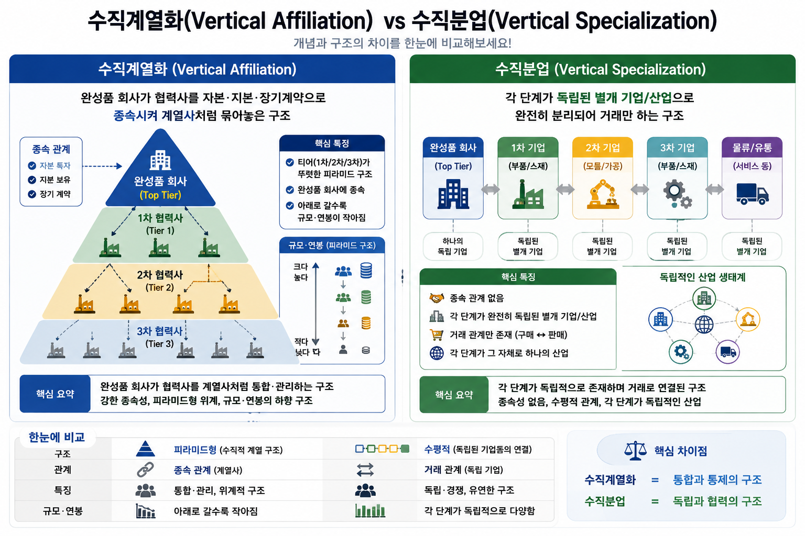
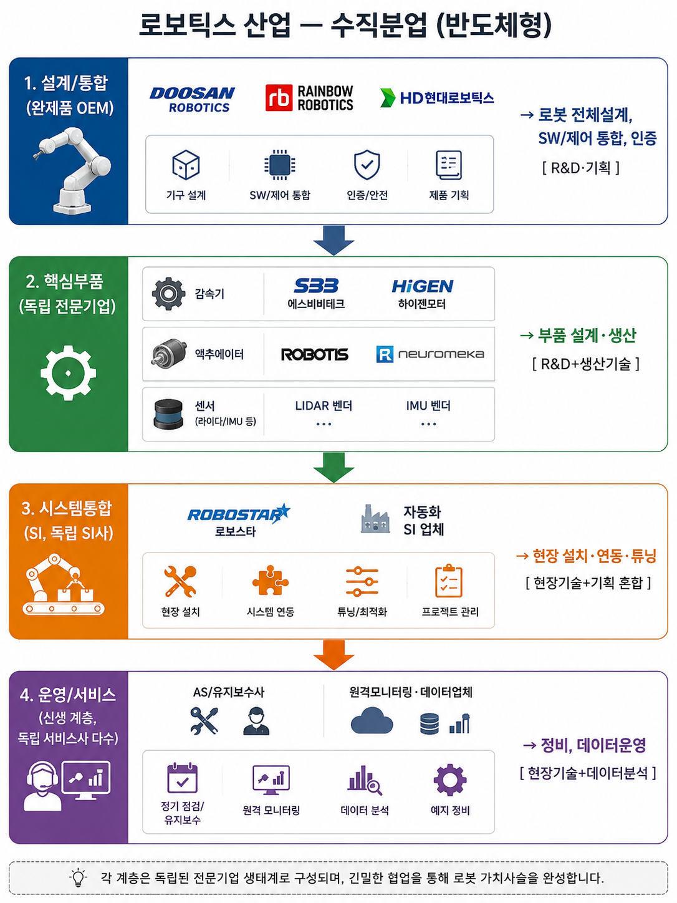

# 엔지니어링 스펙트럼 <br> 자동차·반도체·로보틱스 산업구조로 읽는 직업의 지도

> 특성화고 로보틱스 풀스택 직무체험 과정 (10일 70시간) 참고자료

---

## 1. 두 가지 산업구조 개념

| 개념 | 정의 | 핵심 특징 |
|:---:|---|---|
| **수직계열화**<br>(Vertical Affiliation) | 완성품 회사가 협력사를 <br> **자본·지분·장기계약으로 종속**시켜 <br> 계열사처럼 묶어놓은 구조 | 티어(1차/2차/3차)가 뚜렷하고, <br> 아래로 갈수록 규모·연봉이 작아지는 피라미드 |
| **수직분업**<br>(Vertical Specialization) | 각 단계가 **독립된 별개 기업/산업**으로 <br> 완전히 분리되어 거래만 하는 구조 | 종속관계 없음, <br> 각 단계가 그 자체로 하나의 산업 |



---

## 2. 자동차 산업 — 수직계열화

| 티어 | 대표 기업 | 하는 일 | 스펙트럼 위치 |
|---|---|---|---|
| **완성차(OEM)** | 현대자동차, 기아 | 설계·기획·브랜드·최종조립 | R&D·기획 중심 |
| **1차 협력사(Tier 1)** | 현대모비스, 만도, 현대트랜시스 | 모듈 단위(브레이크, 파워트레인) 설계·납품 | 설계 + 생산관리 |
| **2차 협력사(Tier 2)** | 커넥터·센서하우징 등 부품가공 업체 | 개별 부품 가공·조립 | 생산기술 중심 |
| **3차 협력사(Tier 3)** | 철강·플라스틱 원료 공급사 | 원자재 생산 | 설비운영 중심 |

**구조 특징**: OEM이 협력사를 지분·계약으로 계열화. 완성차에서 3차 협력사로 내려갈수록 R&D → 생산기술 → 설비운영으로 역할이 이동하며, 회사 규모와 연봉도 대체로 함께 작아짐.

---

## 3. 반도체 산업 — 수직분업

```
설계 (Design)
 ├─ 팹리스: 삼성 System LSI, LX세미콘, 퀄컴 → 회로설계, RTL/검증 [R&D]
 └─ IP/EDA: ARM, 시놉시스 → 설계자산·툴 제공 [R&D]
        │
제조 (Fabrication)
 └─ 파운드리: TSMC, 삼성파운드리 → 웨이퍼 공정
        ├─ 공정엔지니어 [R&D·공정기술]
        └─ 오퍼레이터(교대근무) [생산운영]
        │
패키징/테스트 (Back-end)
 └─ 네패스, SFA반도체 → 칩 절단·패키징·검사 [생산운영+품질관리]
        │
소부장 (장비·소재)
 ├─ 장비: 원익IPS, 세메스 → 장비 개발+유지보수 [R&D+현장기술]
 └─ 소재: 솔브레인, 동진쎄미켐 → 화학소재 생산 [생산운영+R&D]
```

**구조 특징**: 각 단계가 완전히 다른 별개 기업/산업(팹리스는 공장이 없고, 파운드리는 설계 안 함). 자본 종속관계가 아니라 순수 거래관계.

---

## 4. 로보틱스 산업 — 수직분업 (반도체형)



```
설계/통합 (완제품 OEM)
 └─ 두산로보틱스, 레인보우로보틱스, HD현대로보틱스
      → 로봇 전체설계, SW/제어 통합, 인증 [R&D·기획]
        │
핵심부품 (독립 전문기업)
 ├─ 감속기: 에스비비테크, 하이젠모터
 ├─ 액추에이터: 로보티즈, 뉴로메카
 └─ 센서: 라이다/IMU 벤더
      → 부품 설계·생산 [R&D+생산기술]
        │
시스템통합 (SI, 독립 SI사)
 └─ 로보스타, 자동화 SI 업체
      → 현장 설치·연동·튜닝 [현장기술+기획 혼합]
        │
운영/서비스 (신생 계층, 독립 서비스사 다수)
 └─ AS/유지보수사, 원격모니터링·데이터업체
      → 정비, 데이터운영 [현장기술+데이터분석]
```

**구조 특징**: 완제품사가 부품사를 지분으로 종속시키지 않고 각자 독립기업으로 거래. 자동차식 "계열사" 구조가 아니라 반도체식 "기능별 분업" 구조에 가까움.

**로보틱스만의 차이점**: 자동차·반도체는 완제품 이후 단계가 상대적으로 작지만, 로보틱스는 판매 후에도 지속적인 설치·정비·데이터운영이 필요해 **"운영/서비스" 계층이 별도로 크게 존재**한다는 점이 특징.

---

# 로봇산업 수직계층 구조 (반도체 산업 유사 프레임워크)

> 자동차 산업의 수직계열화(완성차 중심 하청구조)와 달리, 로봇산업은 반도체 산업처럼 **계층별 독립 전문기업**이 수평적으로 분업하는 구조에 가깝다.

---

## 1. 설계/통합 (완제품 OEM)

**대표 기업**: 두산로보틱스, 레인보우로보틱스, HD현대로보틱스

### 직군
- 로봇 시스템 엔지니어 (기구+제어 통합)
- 모션제어 엔지니어
- SW 플랫폼 엔지니어 (미들웨어/드라이버)
- 인증/규격 엔지니어 (ISO 10218, KC인증)
- PM/기획 (수요처 스펙 협의)

### 업무
- 전체 로봇 아키텍처 설계 (자유도, 가반하중, 작업반경 결정)
- 모션 플래닝 알고리즘 통합
- 안전인증 대응 (협동로봇 안전규격)
- 고객사 맞춤 SI 스펙 정의

### 환경/툴
- **CAD**: SolidWorks, CATIA, NX
- **제어**: TwinCAT, EtherCAT 마스터, RT-Linux
- **SW**: ROS2 (Humble/Jazzy), MoveIt2, C++/Python
- **시뮬레이션**: NVIDIA Isaac Sim, Gazebo
- **버전관리/CI**: GitLab, Jenkins

**직무 성격**: R&D · 기획

---

## 2. 핵심부품 (독립 전문기업)

### 2-1. 감속기
**대표 기업**: 에스비비테크, 하이젠모터

| 구분 | 내용 |
|---|---|
| 직군 | 기구설계, 재료공학, 생산기술(정밀가공) |
| 업무 | 하모닉드라이브/사이클로이드 감속기 설계, 백래시 최소화, 내구성 시험 |
| 환경 | FEM 해석(ANSYS), 정밀측정(CMM), 기어 가공 CAM(Mastercam) |

### 2-2. 액추에이터
**대표 기업**: 로보티즈, 뉴로메카

| 구분 | 내용 |
|---|---|
| 직군 | 모터제어 엔지니어, 펌웨어 엔지니어, 전력전자 엔지니어 |
| 업무 | BLDC/서보모터 드라이버 설계, FOC 제어, 토크센서 통합, 다이나믹셀 프로토콜 개발 |
| 환경 | STM32/TI C2000 펌웨어, LTspice, 오실로스코프/파워애널라이저, CAN/RS485 통신 스택 |

### 2-3. 센서 (라이다/IMU)
**대표 기업**: 라이다/IMU 벤더

| 구분 | 내용 |
|---|---|
| 직군 | 신호처리 엔지니어, 센서퓨전 엔지니어, 광학/RF 엔지니어 |
| 업무 | 포인트클라우드 캘리브레이션, 칼만필터 기반 센서퓨전, 노이즈 특성화 |
| 환경 | PCL(Point Cloud Library), Eigen, MATLAB, ROS2 sensor_msgs, IMU 드라이버 개발 |

**직무 성격**: R&D + 생산기술

---

## 3. 시스템통합 (SI, 독립 SI사)

**대표 기업**: 로보스타, 자동화 SI 업체

### 직군
- 현장 SI 엔지니어 (설치/배선/네트워크)
- PLC/HMI 엔지니어
- 비전검사 엔지니어
- 커미셔닝 엔지니어 (튜닝/트러블슈팅)

### 업무
- 로봇+PLC+컨베이어+비전 연동 설계
- 현장 I/O 배선, 필드버스 구성
- Cycle time 튜닝, 충돌회피 경로 최적화
- 고객사 라인 인수/트레이닝

### 환경/툴
- **PLC**: 미쓰비시 GX Works, 지멘스 TIA Portal, 알렌브래들리 Studio 5000
- **필드버스**: EtherCAT, PROFINET, Modbus TCP
- **비전**: Cognex In-Sight, Halcon, OpenCV
- **HMI**: WinCC, 위지트
- **로봇 티칭펜던트**: 제조사별 전용 언어 (KRL, RAPID, INFORM)

**직무 성격**: 현장기술 + 기획 혼합

---

## 4. 운영/서비스 (신생 계층, 독립 서비스사 다수)

**대표 기업**: AS/유지보수사, 원격모니터링·데이터업체

### 직군
- 필드서비스 엔지니어 (정비/부품교체)
- 예지보전(PdM) 데이터 엔지니어
- 원격모니터링 플랫폼 개발자
- 고객지원(CS) 엔지니어

### 업무
- 정기점검, 고장진단(진동/전류 패턴 분석)
- 원격 대시보드 구축 (가동률, 알람 이력)
- 예지보전 모델 개발 (베어링 마모, 감속기 열화 예측)
- 데이터 파이프라인 구축 (엣지→클라우드)

### 환경/툴
- **IoT**: MQTT, OPC-UA, AWS IoT Core / Azure IoT Hub
- **데이터분석**: Python(Pandas, scikit-learn), Grafana, InfluxDB/TimescaleDB
- **엣지**: Raspberry Pi, Jetson Nano/Orin (엣지 추론)
- **원격진단**: VPN 기반 원격접속, 로그 수집 에이전트

**직무 성격**: 현장기술 + 데이터분석

---

## 계층 간 이동 경로 (커리큘럼 설계 관점)

학생들이 "어느 계층에서 시작해 어디로 확장 가능한가"를 보여주는 것이 중요하다.

| 시작 계층 | 확장 방향 |
|---|---|
| STM32 펌웨어 (액추에이터 계층) | → ROS2 통합(설계/통합 계층) 또는 IoT 모니터링(운영 계층) |
| ROS2/시뮬레이션 (설계/통합) | → PLC 연동 SI, 또는 Isaac Sim 기반 디지털트윈(운영) |
| 센서퓨전(핵심부품) | → 예지보전 데이터분석(운영/서비스) |

## 반도체 산업과의 유사성

| 로봇산업 계층 | 반도체산업 대응 |
|---|---|
| 설계/통합 (완제품 OEM) | 파운드리 |
| 핵심부품 (독립 전문기업) | 팹리스 |
| 시스템통합 (SI) | 패키징/테스트 |
| 운영/서비스 | 사후지원(RMA/필드서비스) |

자동차 산업의 수직계열화 하청구조가 아니라, 반도체 산업처럼 **계층별 독립 전문기업이 수평 분업**하는 구조라는 것이 로봇산업 이해의 핵심이다.


---

## 5. 세 산업 한눈에 비교

| | 자동차 | 반도체 | 로보틱스 |
|---|---|---|---|
| **구조 유형** | 수직계열화 | 수직분업 | 수직분업 (반도체형) |
| **단계 간 관계** | 자본·지분 종속 | 독립 기업 간 거래 | 독립 기업 간 거래 |
| **대표 피라미드** | OEM → 1차 → 2차 → 3차 | 설계 → 제조 → 패키징 → 소부장 | 완제품 → 부품 → SI → 운영서비스 |
| **역할 스펙트럼 변화** | R&D → 생산관리 → 생산기술 <br> → 설비운영으로 순차 이동 | 단계별로 기능 자체가 다름 <br> (파운드리 내부에도 R&D~생산운영 공존) | R&D~생산기술까지는 반도체形, <br> 운영/서비스 계층이 별도로 크게 존재 |

---

## 6. 커리큘럼 시사점

학생들에게 "로봇 산업 = 로봇 만드는 대기업"이라는 좁은 이미지 대신, 설계·부품·시스템통합·운영서비스라는 **네 가지 독립된 직업군**이 있고 각 군이 R&D부터 현장운영까지 이어지는 하나의 연속적인 스펙트럼 위에 놓여 있다는 것을 보여주는 것이 핵심입니다. 어느 직무든 우열이 있는 게 아니라 스펙트럼 상의 다른 위치일 뿐이라는 관점을 먼저 잡아준 뒤, 자동차의 "계열화 피라미드"와 반도체의 "기능별 분업" 두 모델을 비교하고, 로보틱스가 후자에 가깝다는 걸 짚어주면 이해가 빠를 것으로 보입니다.
