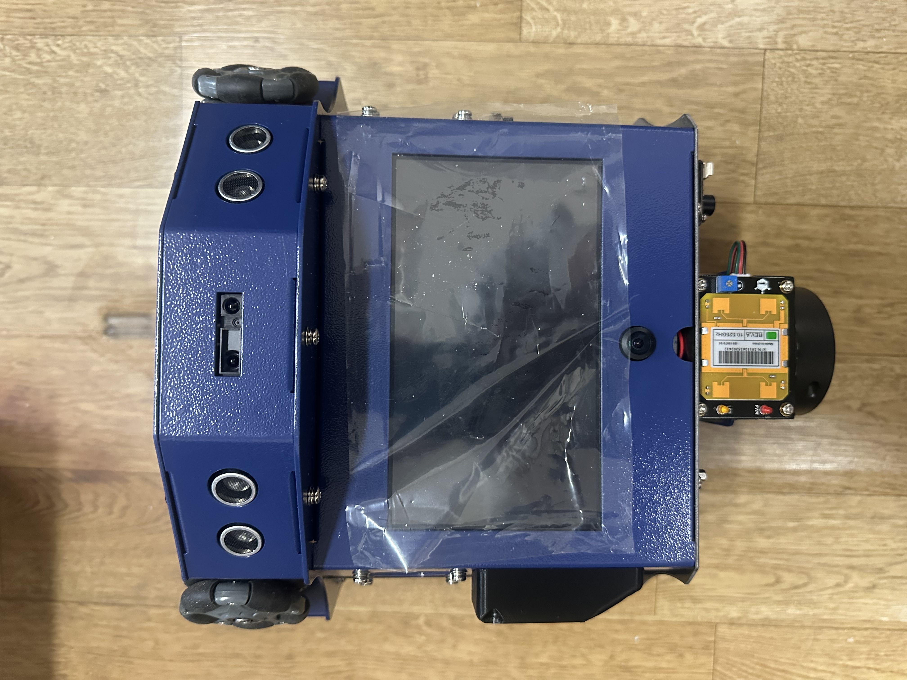
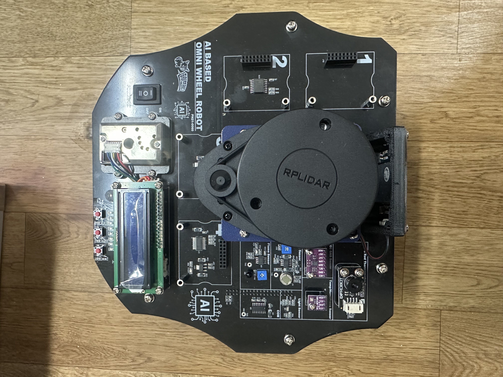
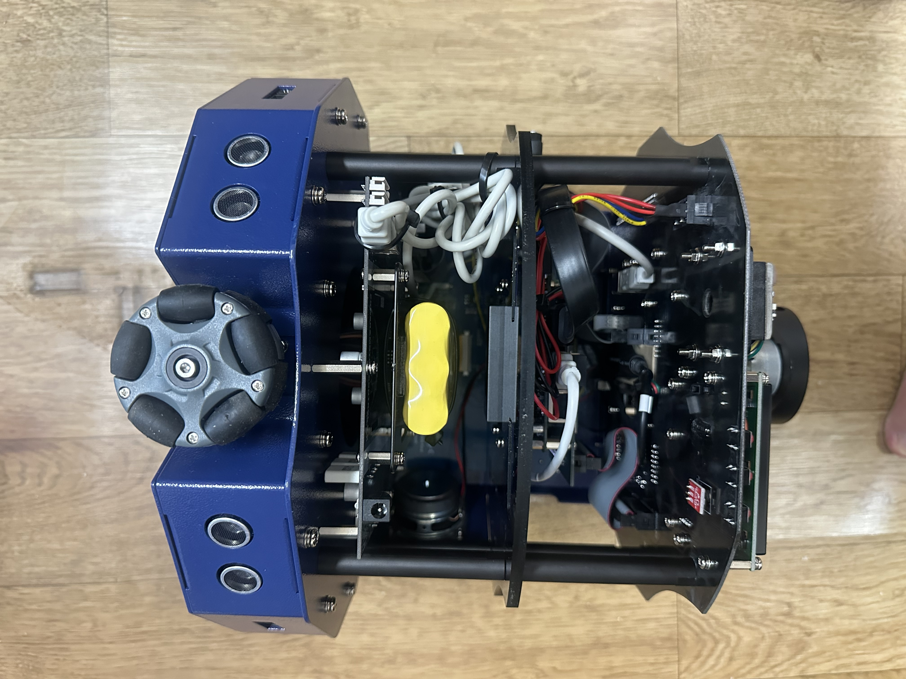
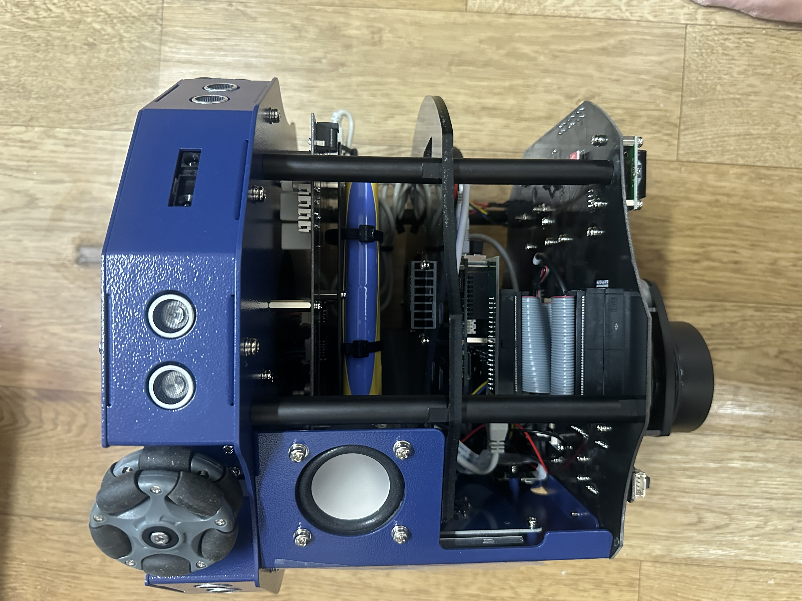

# 자율주행하드웨어개발 커리큘럼 개요

옴니휠 로봇은 로봇 상부에 장착된 다양한 센서 및 액푸에이터의 모니터링 및 제어가 가능하며,  
인공지능을 이용하여 객체 감지 및 객체 추적을 위한 Jetson 보드와 Lidar 세서를 이용하여 주변 지형의 지도를 제작하고  
지도를 기반으로 목적지까지 자유롭게 이동을 할 수 있는 로봇이다.

## 활용 장비

**플랫폼: NVIDIA Jetson Xavier NX Developer Kit**

| 구성 요소 | 사양 |
|-----------|------|
| 메인 컴퓨터 | NVIDIA Jetson Xavier NX (8GB RAM, 6코어 Carmel ARM 64-bit) |
| GPU | 384-core NVIDIA Volta GPU + 2x NVDLA |
| JetPack | R32.6.1 (Ubuntu 18.04 aarch64) |
| 구동계 | 옴니휠 3개 + 각각 DC 모터 + 모터 드라이버 (L298N/TB6612) |
| 거리 센서 | 초음파 센서 HC-SR04 x 3 |
| 근접 센서 | IR 근접센서 x 3 |
| 환경 센서 | 습도 센서 (DHT11), 화재 감지 센서 (불꽃 센서) |
| 위치 인식 | LiDAR (RPLiDAR A1/A2) |
| 출력 장치 | LCD 디스플레이 (I2C 1602/2004) |
| 입력 장치 | 무선 키보드 / 마우스 |
| 전원 | 배터리 팩 |
| S/W 플랫폼 | Ubuntu 18.04 + ROS1 Melodic (또는 ROS2 Eloquent) + Python3 |
| 설계 도구 | EasyEDA (회로), FreeCAD (기구), 오실로스코프/로직 애널라이저 |

### 로봇 세부 구조 (정면)

### 로봇 세부 구조 (상단)

### 로봇 세부 구조 (후면)

### 로봇 세부 구조 (측면)

