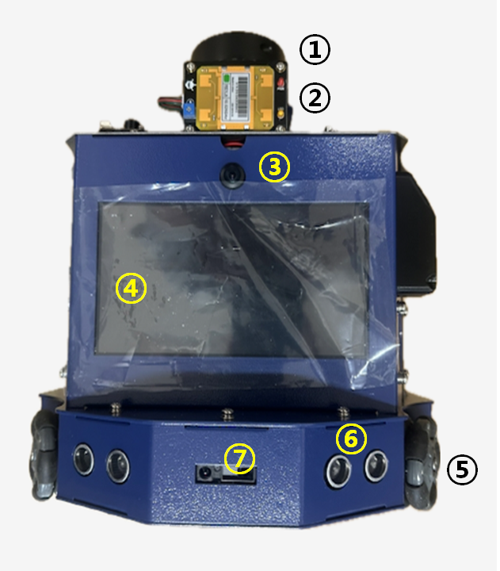
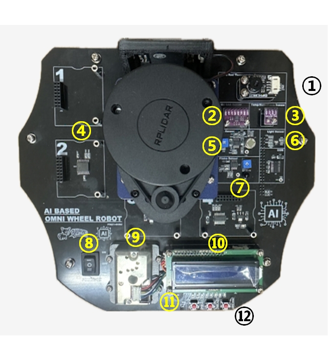
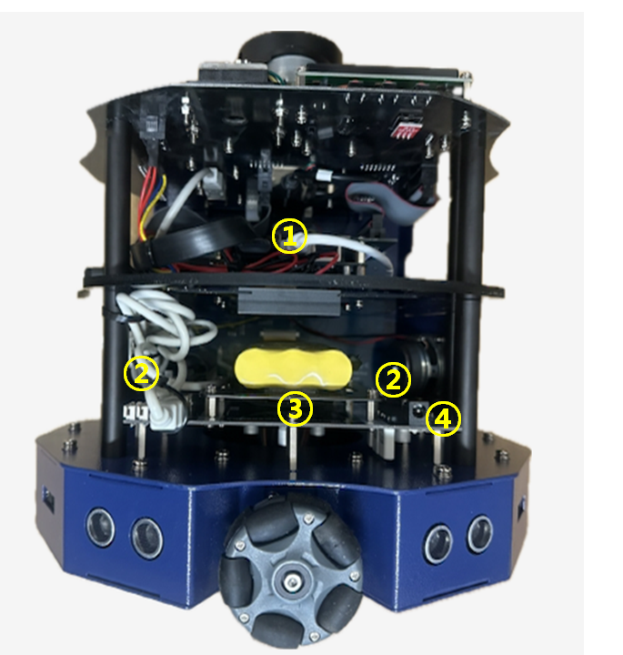
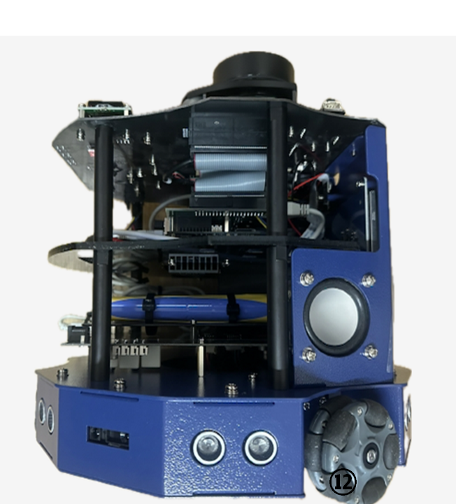

# 자율주행하드웨어개발 커리큘럼 개요

옴니휠 로봇은 로봇 상부에 장착된 다양한 센서 및 액푸에이터의 모니터링 및 제어가 가능하며,  
인공지능을 이용하여 객체 감지 및 객체 추적을 위한 Jetson 보드와 Lidar 세서를 이용하여 주변 지형의 지도를 제작하고  
지도를 기반으로 목적지까지 자유롭게 이동을 할 수 있는 로봇이다.

## 활용 장비

**플랫폼: NVIDIA Jetson Xavier NX Developer Kit**

| 구성 요소 | 사양 |
|-----------|------|
| 메인 컴퓨터 | NVIDIA Jetson Xavier NX (8GB RAM, 6코어 Carmel ARM 64-bit) |
| GPU | 384-core NVIDIA Volta GPU + 2x NVDLA |
| JetPack | R32.6.1 (Ubuntu 18.04 aarch64) |
| 구동계 | 옴니휠 3개 + 각각 DC 모터 + 모터 드라이버 (L298N/TB6612) |
| 거리 센서 | 초음파 센서 x 6 |
| 근접 센서 | IR 근접센서 x 3 |
| 환경 센서 | 습도 센서 (DHT11), 화재 감지 센서 (불꽃 센서) |
| 위치 인식 | LiDAR (RPLiDAR A1/A2) |
| 출력 장치 | LCD 디스플레이 (I2C 1602/2004) |
| 입력 장치 | 무선 키보드 / 마우스 |
| 전원 | 배터리 팩 |
| S/W 플랫폼 | Ubuntu 18.04 + ROS1 Melodic (또는 ROS2 Eloquent) + Python3 |
| 설계 도구 | EasyEDA (회로), FreeCAD (기구) |

### 로봇 세부 구조 (정면)

| 이미지 | 설명 |
| :---: | :--- |
|  | ① **LiDAR** :  SLAM을 이용하여 로봇의  주행환경을 SCAN 및 분석한다.  ② **움직임 감지 센서** :  움직임을 감지하여  그 값을 로봇에 전달해 준다.   ③ **카메라** :  이미지 분류, 객체 인식을 위한 카메라가 위치하고 있다.  ④ **LCD** :  로봇에 장착된 Jetson 보드의 화면을 보여 준다.   ⑤ **바퀴(모터)** :  로봇 옴니휠 바퀴와 엔코더가 장착되어 있어 주행 속도 및 방향을 제어한다.   ⑥ **초음파 센서** :  로봇 전방의 장애물을 감지한다.  ⑦ **IR 근접 센서** :  로봇 몸체의 3 방향으로 장애물을 감지한다. |

* 빛 탐지 거리 및 측정(Light Detection And Ranging)

### 로봇 세부 구조 (상단)

| 이미지 | 설명 |
| :---: | :--- |
|  | ① **적외선 온도센서** :  적외선을 이용하여 온도를 측정한다.  ② **CO2 Gas 센서** :  CO2와 TVOC를 측정한다.   ③ **온도/습도/기압 센서** :  온도, 습도, 기압을 한 번에 측정한다.  ④ **센서 확장 플랫폼** :  추가로 센서를 장착 할 수 잇는 플렛폼이다.  ⑤ **PIR 센서** :  움직임을 감지하는 센서이다.  ⑥ **Light 센서** :  빛의 양을 감지하는 센서이다.  ⑦ **Flame 센서** :  불꽃을 감지하는 센서이다.  ⑧ **전원 Switch** :  로봇의 전원을 ON/OFF 제어한다.   ⑨ **미세먼지 센서** :  미세먼지의 양을 측정하는 센서이다.  ⑩ **상태표시 LCD** :  로봇의 동작 모드에 관련된 상태가 표시된다.  ⑪ **PIEZO** :  주파수에 따라 출력 음을 다르게 제어할 수 있다.  ⑫ **모드 선택 Switch 와 LED** :  3개의 Switch를 이용하여  메뉴를 이동하고 선택할 수 있으며,  8개의 LED를 제어할 수 있다.|

### 로봇 세부 구조 (후면)

| 이미지 | 설명 |
| :---: | :--- |
|  | ① **메인보드** :   인공지능을 이용해 객체 감지 및  객체 추적을 위해  Jetson 보드가 장작된다.  ② **스피커** :   차량에서 발생하는 사운드가 발생한다.   ③ **배터리** :   배터리가 장착되어 있다.   ④ **충전기 연결 포트** :   배터리를 충전기와 연결하는 포트|

### 로봇 세부 구조 (측면)

| 이미지 | 설명 |
| :---: | :--- |
|  |  |

