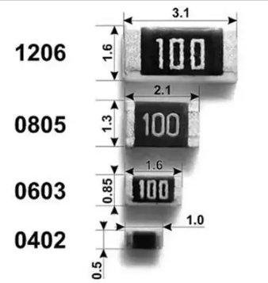
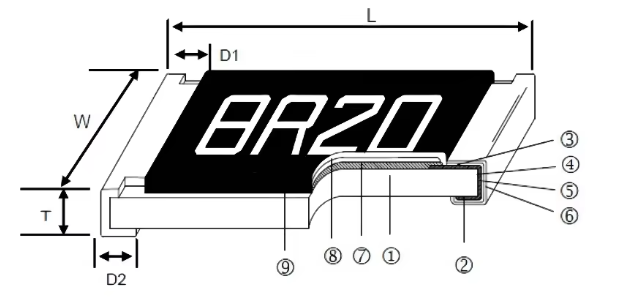
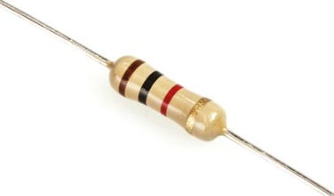
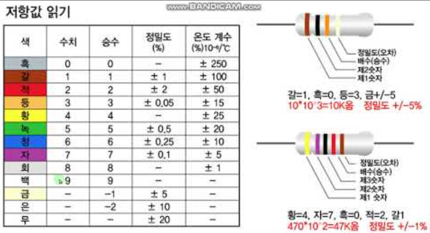

# 부품 패키지(크기) 용어 정리 & 구매처 가이드

> 회로도(Schematic) 작성과 PCB 아트웍(Layout) 수업에서 자주 등장하는
> R(저항) / L(인덕터) / C(캐패시터) 부품의 **크기 표기법**과 **값 읽는 법**,
> 커넥터·부품을 **구매할 때 참고할 회사와 링크**를 정리한 문서입니다.

---

## 1. SMD 부품 크기 표기법 — 인치 코드 vs 밀리미터 코드

SMD 부품(저항/캐패시터/인덕터/페라이트비드)의 크기는
**인치(Imperial) 코드**와 **밀리미터(Metric) 코드** 두 가지로 불립니다.

> **핵심 예시 — "1608"**
>
> - `1608`은 **밀리미터 코드**로, **1.6mm × 0.8mm** 부품을 뜻합니다.
> - 이 부품의 **인치 코드**는 `0603` (0.06inch × 0.03inch).
> - 즉 **1608 = 0603** 같은 부품입니다! (인치 코드가 국내외에서 더 흔히 사용됨)

| 인치 코드 (Imperial) | 밀리미터 코드 (Metric) | 실측 크기 (mm) | 2.54mm 기준 환산 (inch) |
|---|---:|---:|---:|
| 01005 | 0402 | 0.4 × 0.2 | 0.016 × 0.008 |
| 0201 | 0603 | 0.6 × 0.3 | 0.024 × 0.012 |
| 0402 | 1005 | 1.0 × 0.5 | 0.04 × 0.02 |
| **0603** | **1608** | **1.6 × 0.8** | **0.06 × 0.03** |
| 0805 | 2012 | 2.0 × 1.2 | 0.08 × 0.05 |
| 1206 | 3216 | 3.2 × 1.6 | 0.12 × 0.06 |
| 1210 | 3225 | 3.2 × 2.5 | 0.12 × 0.10 |
| 1812 | 4532 | 4.5 × 3.2 | 0.18 × 0.12 |
| 2010 | 5025 | 5.0 × 2.5 | 0.20 × 0.10 |
| 2512 | 6432 | 6.4 × 3.2 | 0.25 × 0.12 |

**쉽게 외우는 법**: 인치 코드 숫자에 ×25.4 하면 실측(밀리미터)이 됩니다.
예) `0603` → 0.06" × 0.03" = 1.52mm × 0.76mm ≈ **1.6 × 0.8mm**

### 1.1 크기별 정격 전력 (저항)

같은 부품값이라도 크기가 클수록 견딜 수 있는 전력(W)이 커집니다.

| 인치 코드 | 정격 전력 (대표값) | 주 사용처 |
|---|---:|---|
| 01005 | 1/32W | 웨어러블, 미니어처 |
| 0201 | 1/20W (0.05W) | 스마트폰 등 초소형 |
| 0402 | 1/16W (0.063W) | 디지털 회로의 소신호 |
| **0603** | **1/10W (0.1W)** | **일반 디지털 회로 (가장 흔함)** |
| 0805 | 1/8W (0.125W) | 아날로그, LED 전류제한 |
| 1206 | 1/4W (0.25W) | 전원 분압, 풀업 |
| 2010 | 1/2W (0.5W) | 전원 경로 |
| 2512 | 1W | 전원 션트, LED 모듈 |

### 1.2 MLCC (세라믹 캐패시터) 크기와 정격

- MLCC의 정격전압은 **같은 캐패시턴스에서 크기가 클수록 높게** 설정 가능.
- 같은 크기라도 캐패시턴스가 커지면 정격전압이 낮아지는 트레이드오프.
- **전압 디레이팅 규칙**: 실사용 전압의 **2배 이상** 여유 정격 권장
  (예: 3.3V 회로 → 6.3V 또는 10V, 12V 회로 → 25V).

| 인치 코드 | 대표 캐패시턴스 (저전압 기준) |
|---|---:|
| 0201 | ~100nF |
| 0402 | ~1uF |
| 0603 | ~4.7uF |
| 0805 | ~10uF |
| 1206 | ~100uF |

**유전체(Dielectric) 종류**:

| 등급 | 특징 | 용도 |
|------|------|------|
| C0G / NP0 | 온도변화 거의 없음, 저손실 | 크리스탈 부하 캡, 필터 |
| X7R | -55~125℃, ±15% | 범용 전원 바이패스 |
| X5R | -55~85℃, ±15% | 범용 (가장 흔함) |
| Y5V / Z5U | 온도 특성 나쁨, 용량 큼 | 저가 대용량, 권장 안 함 |

> **Tip**: EasyEDA / JLCPCB에서 바이패스 캡으로 **0603(1608) X7R 100nF** 류를
> 주로 사용합니다. 크기가 커지면 부품 높이가 높아져 인접 부품과 간섭에 주의.

### 1.3 인덕터 (L)

- **칩 인덕터 (고주파 필터용)**: 저항/캡과 동일한 크기 코드 사용
  (0603, 0805, 1206 등).
- **파워 인덕터 (전원용)**: 크기를 mm로 직접 표기 (예: 4×4, 5×5, 6×6mm)
  또는 제조사 코드 사용 (예: XAL4020, XAL6060 — 4.0mm×4.0mm, 6.0mm×6.0mm).
- 선택 시 **포화 전류(Isat)**, **정격 전류**가 크기보다 중요합니다.
- **페라이트 비드 (Ferrite Bead)**: 크기 코드는 칩 부품과 동일 (0402/0603/0805).
   (예: OpenCR의 VDDA 분리용 BLM18PG471 = 0603 크기)

---

## 2. 저항 · 캐패시터 · 인덕터 값 읽는 법

### 2.1 단위 접두어 (공통)

| 접두어 | 기호 | 배수 | 예 |
|--------|------|------|-----|
| pico | p | 10⁻¹² | pF (피코패럿) |
| nano | n | 10⁻⁹ | nF (나노패럿) |
| micro | u (μ) | 10⁻⁶ | uF, uH |
| milli | m | 10⁻³ | mH |
| kilo | k | 10³ | kΩ |
| Mega | M | 10⁶ | MΩ |

> **주의**: 소문자 `m`(milli)과 대문자 `M`(Mega)은 다릅니다.
> 데이터시트/라이브러리에서는 `u`로 micro를 표기합니다 (μ 대신 u).

### 2.2 저항 (R) 값 읽기

#### 스루홀 저항 — 색띠 (Color Code)

저항 본체의 색띠를 왼쪽(금/은색 띠의 반대편)에서 읽습니다.

| 색 | 숫자 | 배수(승수) | 허용오차 |
|----|------|-----------|----------|
| 검정 | 0 | ×1 | — |
| 갈색 | 1 | ×10 | ±1% |
| 빨강 | 2 | ×10² | ±2% |
| 주황 | 3 | ×10³ | — |
| 노랑 | 4 | ×10⁴ | — |
| 초록 | 5 | ×10⁵ | ±0.5% |
| 파랑 | 6 | ×10⁶ | ±0.25% |
| 보라 | 7 | ×10⁷ | ±0.1% |
| 회색 | 8 | ×10⁸ | — |
| 흰색 | 9 | ×10⁹ | — |
| 금색 | — | ×0.1 | ±5% |
| 은색 | — | ×0.01 | ±10% |

- **4밴드**: `숫자 숫자 × 배수 ±오차`
  예) 갈색-검정-빨강-금색 → 1 0 ×10² = **1kΩ ±5%**
- **5밴드**: `숫자 숫자 숫자 × 배수 ±오차` (정밀 저항, 예: 1% 이하)
  예) 갈색-검정-검정-갈색-갈색 → 1 0 0 ×10¹ = **1kΩ ±1%**
- **6밴드**: 5밴드 + 온도계수(TCR) 띠

#### SMD 저항 — 숫자/문자 코드

| 표기 | 해석 | 값 |
|------|------|-----|
| 472 | 47 × 10² | 4.7kΩ |
| 104 | 10 × 10⁴ | 100kΩ |
| 100 | 10 × 10⁰ | 10Ω |
| 1002 | 100 × 10² (4자리, 정밀) | 10kΩ |
| 4R7 | R = 소수점 | 4.7Ω |
| R100 | R = 소수점 | 0.1Ω |
| 0 | — | 0Ω (점퍼 저항) |

- **3자리**: 앞 2자리 유효숫자 + 마지막 1자리 승수(0의 개수).
- **4자리**: 앞 3자리 유효숫자 + 승수 (1% 정밀 저항에서 사용).
- **R 표기**: `R`을 소수점으로 사용 (`4R7` = 4.7Ω, `1k0` = 1.0kΩ).
- **E96 계열(정밀 저항)**: 문자 2개 + 승수 문자 1개로 표기
  (예: `02C` = 102 × 100 = 10.2kΩ). 주로 저항값이 3자리로 안 맞는 1% 저항에 사용.

### 2.3 캐패시터 (C) 값 읽기

#### SMD 세라믹 캡 — 숫자 코드 (단위 pF!)

> **핵심**: 캐패시터 숫자 코드는 **기본 단위가 pF** 입니다.
> 3자리 숫자 = 앞 2자리 유효숫자 + 마지막 1자리 승수(pF).

| 표기 | 해석 (pF) | 값 |
|------|-----------|-----|
| 104 | 10 × 10⁴ pF | 100nF (0.1uF) |
| 103 | 10 × 10³ pF | 10nF |
| 105 | 10 × 10⁵ pF | 1uF |
| 473 | 47 × 10³ pF | 47nF |
| 100 | 10 × 10⁰ pF | 10pF |
| 220 | 22 × 10⁰ pF | 22pF |
| 4u7 | 4.7 (직접 표기) | 4.7uF |

> **주의**: `104` = 100nF이지 104pF가 아닙니다!
> `100` = 10pF이지 100pF가 아닙니다. 코드를 읽고 **pF에서 환산**하세요.
> 일부 부품은 본체에 `4u7`, `.1u`처럼 직접 표기하기도 합니다.

#### 알루미늄 전해 캡

- 본체에 직접 **값 + 정격전압** 표기 (예: `220uF 25V`).
- 극성 표시: 본체에 `－` 마크가 있는 쪽이 음극, SMD는 상단의 띠가 음극.

#### 탄탈 캡

- 값 표기는 세라믹과 동일한 pF 코드 (예: `107` = 10×10⁷pF = 100uF, `476` = 47uF).
- **정격전압은 별도 문자 코드**로 표기:
  | 문자 | G | J | A | C | D | E | V | T |
  |------|---|---|---|---|---|---|---|---|
  | 전압 | 4V | 6.3V | 10V | 16V | 20V | 25V | 35V | 50V |
- 극성: (+) 쪽에 바(bar) 표시 (일반 세라믹과 반대라 헷갈리기 쉬움).

### 2.4 인덕터 (L) 값 읽기

#### 칩 인덕터 — 숫자 코드 (단위 uH 또는 nH)

| 표기 | 해석 | 값 |
|------|------|-----|
| 100 | 10 × 10⁰ uH | 10uH |
| 101 | 10 × 10¹ uH | 100uH |
| 4R7 | 4.7 uH | 4.7uH |
| R10 | 0.1 uH | 100nH |
| 47n / 4N7 | nH 직접 표기 | 47nH / 4.7nH |

- 고주파용 칩 인덕터는 **nH 단위**로 표기되는 경우가 많습니다.
- 숫자 코드의 기본 단위는 제조사에 따라 **uH 또는 nH**로 다르므로
  **데이터시트를 반드시 확인**해야 합니다.

#### 파워 인덕터

- 본체나 데이터시트에 **uH 값 + 전류 정격**이 직접 표기
  (예: XAL6060-472 = 4.7uH).
- 인덕터는 **포화 전류(Isat)**가 정격보다 작아지는 기준이 되므로
  값(uH)만 보고 고르면 안 됩니다.

### 2.5 숫자 코드 해석 요약표

| 코드 | 종류 | 단위 기준 | 값 |
|------|------|-----------|-----|
| 104 | 캐패시터 | pF | 100nF |
| 105 | 캐패시터 | pF | 1uF |
| 472 | 저항 | Ω | 4.7kΩ |
| 104 | 저항 | Ω | 100kΩ |
| 100 | 저항 | Ω | 10Ω |
| 100 | 캐패시터 | pF | 10pF |
| 100 | 인덕터 | uH | 10uH |
| 4R7 | 저항 | Ω | 4.7Ω |
| 4R7 | 인덕터 | uH | 4.7uH |
| 4u7 | 캐패시터 | uF | 4.7uF |

### 2.6 허용오차 문자 코드

| 문자 | 허용오차 | 주 사용처 |
|------|----------|-----------|
| F | ±1% | 정밀 캡/인덕터 |
| G | ±2% | 정밀 저항 |
| J | ±5% | 저항·캡 |
| K | ±10% | 범용 캡 |
| M | ±20% | 전해 캡 (알루미늄 등) |

> **Tip**: 부품값 단위·오차는 EasyEDA 라이브러리의 **Value(속성)** 칸에
> 그대로 입력합니다. 예) 저항 `4.7k`, 캡 `100nF`, 인덕터 `4.7uH`.
> 회로도에서 값만 봐도 바로 이해되도록 단위를 붙여 쓰는 것이 좋습니다.

---

## 3. 탄탈(TANTAL) 커패시터 크기

탄탈 커패시터는 **EIA 케이스 코드 (A~E)** 로 크기를 표기합니다.
인치 코드와 비슷해 보이지만 **별도의 규격**이므로 구분해야 합니다.

| 케이스 코드 | 표준 치수 표기 | 실측 크기 (mm) | 인치 코드 근사 |
|---|---|---|---|
| P | 2012-15 | 2.0 × 1.2 × 1.2 | 0805 |
| A | 3216-18 | 3.2 × 1.6 × 1.6 | 1206 |
| B | 3528-21 | 3.5 × 2.8 × 1.9 | 1210 |
| C | 6032-28 | 6.0 × 3.2 × 2.5 | 2312 |
| D | 7343-31 | 7.3 × 4.3 × 2.8 | 2917 |
| E | 7343-43 | 7.3 × 4.3 × 4.0 | 2917 (높음) |
| V | 7343-20 | 7.3 × 4.3 × 2.0 | 2917 (낮음) |
| S | 6032-15 | 6.0 × 3.2 × 1.5 | 2312 |
| U | 6032-28 | 6.0 × 3.2 × 2.8 | 2312 |
| X | 7343-43 | 7.3 × 4.3 × 4.3 | 2917 |

> - 실무에서 가장 많이 쓰는 것은 **A, B, C, D** 케이스.
> - **케이스 코드 숫자 = "치수(밀리미터) - 높이(0.1mm)"** 입니다.
>   예) `3216-18` → 3.2×1.6mm 본체, 높이 1.8mm.

### 3.1 탄탈 커패시터의 종류

| 종류 | 구분 | 특징 |
|------|------|------|
| MnO₂ 탄탈 (기존) | T491, T520 등 | 고온·전압 스트레스에 취약, 폭발 위험 주의 |
| 폴리머 탄탈 | T520/T530 등 | ESR 낮음, 고장 모드가 개선됨, 가격 높음 |

### 3.2 탄탈 커패시터 사용 주의사항 (반드시!)

1. **극성이 있음** — (+) 표시 (바(bar)가 +) 가 있으며 역전압/역삽입 금지.
2. **전압 디레이팅 필수** — 정격전압의 **50% 이하**로 사용 권장
   (예: 12V 회로 → 25V 정격 사용).
3. **높은 돌입전류(Inrush) 주의** — 회로에 감쇠 저항 추가 고려.
4. 낮은 ESR 때문에 순간 전류가 크므로 **전원 출력단**에 주로 사용.
5. 가격이 세라믹보다 비싸므로, 필요한 곳(전원 벌크 캡)에만 사용.

---

## 4. 기타 자주 보는 패키지 용어

### 4.1 크리스탈 / 오실레이터

| 패키지 | 실측 (mm) | 비고 |
|---|---|---|
| 2016 | 2.0 × 1.6 | 초소형 |
| 2520 | 2.5 × 2.0 | 모바일용 |
| **3225** | **3.2 × 2.5** | **일반적인 SMD 크리스탈** |
| 5032 | 5.0 × 3.2 | 정밀/TCXO |
| 7050 | 7.0 × 5.0 | 대형, 정밀 |

### 4.2 알루미늄 전해 커패시터

- SMD: `지름(D) × 높이(H)` 로 표기 (예: 6.3×5.4, 8×10.2, 10×10.2mm).
- 스루홀(래디얼): 지름 × 높이 + 리드 피치(2.5/3.5/5mm) 로 표기.
- 극성 있음(－ 표시), 온도 수명(105℃ 기준 수천 시간) 확인 필요.

### 4.3 IC 패키지 (OpenCR 과정에서 보이는 것들)

| 패키지 | 형태 | 예시 |
|---|---|---|
| LQFP-144 | 평면 4면 리드 | STM32F746ZGT6 |
| QFN-20 / QFN-24 | 리드 없는 칩 | A3906, ICM-20648 |
| SOP-8 | 소형 평면 리드 | TJF1051T, MAX3443 |
| SOT-23-5 | 3핀 + 2핀 | STMPS2141 |
| SOT-223 | 방열탭 있음 | LDO (IL1117, AZ1117) |
| TO-263 (D2PAK) | 방열탭 있음 | XL4005 |
| TO-252 (DPAK) | 중간 방열 | 전원 트랜지스터 |
| HTSSOP-28 | 얇은 평면 28핀 | LM5175 |

### 4.4 스루홀 (DIP) 부품

- 축형(Axial) 저항: 1/4W 본체 약 6.3 × 2.3mm, 리드 간격 무관.
- 래디얼(Radial): 리드 피치로 표기 (2.54mm 등).
- **핀 간격(피치)**: 2.54mm(0.1")가 표준. 그 외 2.0 / 1.27 / 1.0 / 0.5mm.

### 4.5 아트웍(Layout)에서 필요한 피치 용어

| 용어 | 의미 |
|---|---|
| Pitch(피치) | 인접 핀 사이 중심 간격 (2.54 / 2.0 / 1.27 / 1.0 / 0.5mm) |
| Footprint(풋프린트) | PCB 위 부품의 랜드(패드) 모양 — 부품 크기와 동일 코드 사용 |
| Pad(패드) | 납땜 영역, 부품 리드/터미널보다 약간 크게 설계 |
| Solder Mask(솔더마스크) | 주석이 붙지 않도록 덮는 보호막 |
| Courtyard(실장 공간) | 부품의 점유 영역(패드 + 여유), 배치 충돌 검사에 사용 |

> EasyEDA에서 부품 검색 시 `R0603`, `C0603`, `L0603`처럼
> **부품 코드 + 인치 코드**로 풋프린트가 표시됩니다.

---

## 5. 커넥터 유명 회사 및 링크

| 회사 | 특징 | 주요 제품 | 링크 |
|------|------|-----------|------|
| **JST** | 소형 소비자 커넥터의 대명사 | EH/XH/PH/ZH/VH 시리즈 | https://www.jst-mfg.com |
| **TE Connectivity** (AMP) | 산업·자동차 최대 커넥터 | AMP 제품군, 자동차 커넥터 | https://www.te.com |
| **Molex** | 소비자·자동차·산업 | KK, Micro-Fit, USB, FFC/FPC | https://www.molex.com |
| **Hirose** | 고정밀 소형 커넥터 | DF13, DF40, micro-USB, FPC | https://www.hirose.com |
| **Amphenol** | 군사·항공·산업 | D-Sub, RF, 자동차 | https://www.amphenol.com |
| **Samtec** | 고속 신호·정밀 | 헤더, 고속 커넥터 | https://www.samtec.com |
| **Phoenix Contact** | 단자대(Terminal Block) | PCB용 스크류 단자대 | https://www.phoenixcontact.com |
| **Würth Elektronik** | EMI/RF 커넥터, 부품 | WR-MMPC, RF 동축 | https://www.we-online.com |
| **Harwin** | 고신뢰성 커넥터 | Datamate, M300 | https://www.harwin.com |
| **I-PEX** (i-PEX) | 미세 피치·RF | 카메라 FPC, U.FL RF | https://www.i-pex.co.jp |
| **Kyocera-AVX** | RF·PCB 커넥터 | 9159 시리즈 등 | https://www.kyocera-avx.com |
| **Kycon** | 한국계 미국 커넥터사 | DC Jack, D-Sub | https://www.kycon.com |
| **Yamaichi** | 반도체 테스트 소켓 | 소켓, 커넥터 | https://www.yamaichi.co.jp |
| **CNC Tech** | 저가 범용 커넥터 | 헤더, 박스헤더 | https://www.cnctech.us |

> **수업 예제 연관**: OpenCR에서 사용하는 **JST B3B-EH-A**(TTL)와
> **B4B-EH-A**(RS-485)는 위의 **JST EH 시리즈**입니다.
> EasyEDA에서 `B3B-EH-A`로 검색하면 심볼·풋프린트·3D 모델이 함께 로드됩니다.

---

## 6. 부품 구매처 (유명 회사 및 사이트)

### 6.1 해외 대형 유통사 (Distributor)

| 회사 | 특징 | 링크 |
|------|------|------|
| **Digi-Key Electronics** | 미국 최대, 재고/배송 최고 | https://www.digikey.kr |
| **Mouser Electronics** | 미국, 반도체·TI 등 취급 폭 넓음 | https://www.mouser.kr |
| **LCSC (立创商城)** | 중국, 저가, EasyEDA/JLCPCB 연동 | https://www.lcsc.com |
| **Arrow Electronics** | 기업용 대량, 글로벌 | https://www.arrow.com |
| **Newark / element14** | 전세계 네트워크 | https://kr.element14.com |
| **RS Components** | 전세계, 단자대·공구 강세 | https://kr.rs-online.com |
| **TME** | 유럽계, 중저가 | https://www.tme.eu |
| **Avnet** | 글로벌 기업용 | https://www.avnet.com |

### 6.2 EasyEDA / JLCPCB 연동 (수업 핵심)

| 사이트 | 용도 | 링크 |
|--------|------|------|
| **EasyEDA** | 회로도/아트웍 편집 (LCSC 라이브러리 로드) | https://easyeda.com |
| **LCSC** | 부품 검색·구매 (가격·재고·3D 모델) | https://www.lcsc.com |
| **JLCPCB** | PCB/PCBA 제조 주문 (Gerber 업로드) | https://jlcpcb.com |
| JLCPCB 부품 검색 | 조립 가능 부품 필터 | https://jlcpcb.com/parts |

> **수업 워크플로우**: EasyEDA 설계 → LCSC에서 부품 확인 →
> Gerber/BOM 출력 → JLCPCB 주문. 따라서 **JLCPCB 재고가 있는 부품**을
> 처음부터 고르는 것이 효율적입니다. (LCSC 부품코드 예: `C14663` = 0603 100nF)

### 6.3 국내 유통사

| 쇼핑몰 | 특징 | 링크 |
|--------|------|------|
| **엘레파츠 (Eleparts)** | 소량 부품, 아두이노·교육용 | https://www.eleparts.co.kr |
| **디바이스마트 (DeviceMart)** | 소량 부품, 브레드보드 등 | https://www.devicemart.co.kr |
| **아이씨뱅큐 (ICBanQ)** | 센서·모듈 다양 | https://www.icbanq.com |
| **아두이노 스토어** | 아두이노 정품·부품 | https://www.arduinostore.co.kr |
| **모터뱅크** | 모터·드라이버 (RC/로봇) | http://www.motorbank.kr |
| **로보티즈 (ROBOTIS)** | DYNAMIXEL, OpenCR 공식 제조사 | https://www.robotis.com |
| **이지로보틱스** | 로봇 부품·DYNAMIXEL 취급 | https://www.ezrobot.co.kr |

> **주의**: 해외 유통사 배송비·관세(배대지 포함)가 국내 소량 구매보다
> 비쌀 수 있습니다. 프로토타입용 소량 부품은 **국내 쇼핑몰**,
> 본격 양산·시제품 제작은 **JLCPCB + LCSC** 조합을 권장합니다.

---

## 7. 부품 선택·구매 시 추가 참고사항

### 7.1 EasyEDA 검색 팁

- 부품명(예: `B3B-EH-A`) 또는 **LCSC 부품코드**(`C14663`)로 검색하면 정확합니다.
- 검색 결과는 **LCSC Parts(실재고)** → User Contributions 순으로 확인.
- 심볼·풋프린트·3D 모델이 함께 붙는 부품을 우선 선택하세요.
- 선호 부품(예: 0603 저항/캡)은 **라이브러리에 즐겨찾기(Favorite)** 저장.

### 7.2 부품 크기(패키지) 선택 기준

| 상황 | 권장 패키지 |
|------|-------------|
| 일반 디지털 신호 저항/캡 | **0603(1608)** — 납땜/조립 난이도·크기 균형 최적 |
| 크기 절약 필요 (고밀도) | 0402 — 조립기기 전용, 수작업 어려움 |
| 전원부 대용량 캡 | 0805 / 1206 / 탄탈 케이스 |
| 전류 큰 경로 | 1206 이상 또는 파워 인덕터 별도 선택 |
| 수작업 납땜 수업용 | 0603 ~ 0805 (0402 이하는 추천 안 함) |

### 7.3 BOM(부품 목록) 작성 시

- 각 부품에 **LCSC 부품코드**를 적어두면 JLCPCB 조립 주문이 빨라집니다.
- 부품 **치수(패키지)**, **정격(전압/전류/전력)**, **허용오차**를 반드시 표기.
- 대체부품(Alternate)도 기록해 두면 품절 시 빠르게 대응 가능.

### 7.4 아트웍에서의 부품 크기 활용

- 풋프린트는 부품 본체보다 **패드가 0.3~0.4mm 길게** 나오도록 설계.
- 부품 간 최소 간격은 **0.5mm 이상** (0603 기준), 배치 충돌 검사(DRC)로 확인.
- 높이가 있는 부품(전해캡, 파워 인덕터, 커넥터)은 **3D 뷰로 간섭 확인**.

---

## 부록. 이 문서에서 나온 부품의 LCSC/EasyEDA 검색 예시

| 부품 | 패키지 | 검색어 예시 |
|------|--------|-------------|
| 100nF 바이패스 캡 | 0603 (1608) | C14663 |
| 22uF 전원 벌크 캡 | 1206 | C45791 |
| 4.7uH 파워 인덕터 | 6×6mm | XAL6060-472MEB |
| 탄탈 220uF/6.3V | D 케이스 (7343) | T491D227M006AT |
| JST 3핀 커넥터 | EH 시리즈 | B3B-EH-A |
| JST 4핀 커넥터 | EH 시리즈 | B4B-EH-A |

> 위 검색어는 참고용이며, 실제 코드는 LCSC 재고 상황에 따라 달라질 수 있습니다.
