# FreeCAD 포터블 3D CAD — 터틀봇 기구 설계

## 개요

> 3D CAD 도구 FreeCAD(포터블)를 이용하여 **터틀봇(TurtleBot)** 의 기구부를 전면 설계한다.
> 총 **3일 / 21h** 과정 — 기구 설계 전주기(모델링→조립→해석→출력→최적화) 체험

## 사용 도구

| 도구 | 용도 | 다운로드 |
|------|------|---------|
| FreeCAD 1.1.1 | 3D CAD 모델링 (포터블) | https://github.com/FreeCAD/FreeCAD/releases/download/1.1.1/FreeCAD_1.1.1-Windows-x86_64-py311.7z |
| WinRAR / 7-Zip | 7z 압축 해제 | https://www.7-zip.org/ |
| Ultimaker Cura | 슬라이싱 (선택) | https://ultimaker.com/software/ultimaker-cura |

## 학습 구조

## 터틀봇 부품 목록

| 부품명 | 개수 | 설명 |
|--------|------|------|
| Base Plate (하판) | 1 | 원형, Φ180mm, 두께 5mm |
| Top Plate (상판) | 1 | 원형, Φ160mm, 두께 3mm |
| Drive Wheel (구동바퀴) | 2 | Φ66mm × 25mm |
| Tire (타이어) | 2 | Φ66mm, 두께 3mm (고무 재질) |
| Motor Mount (모터 마운트) | 2 | N20 모터 장착 브라켓 |
| Ball Caster Bracket | 1 | Φ10mm 볼 캐스터 장착부 |
| LiDAR Mount | 1 | RPLiDAR A1 장착대 |
| Standoff (기둥) | 4~6 | 상판-하판 연결 지지대 |

----

## 1. Gravity: I2C Non-contact IR Temperature Sensor For Arduino (MLX90614-DCC) : $18.50

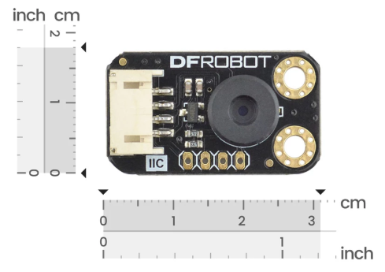 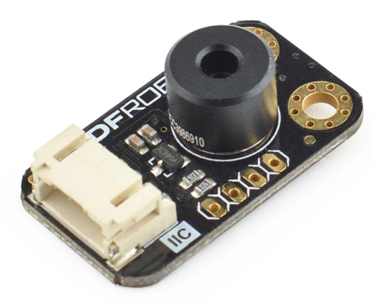

https://www.dfrobot.com/product-1495.html

## 2. Motor : D&J WITH Co., Ltd : RB35GM 11TYPE 1/50 DC 12V W/EC 26P

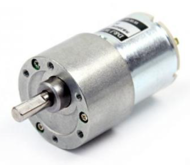 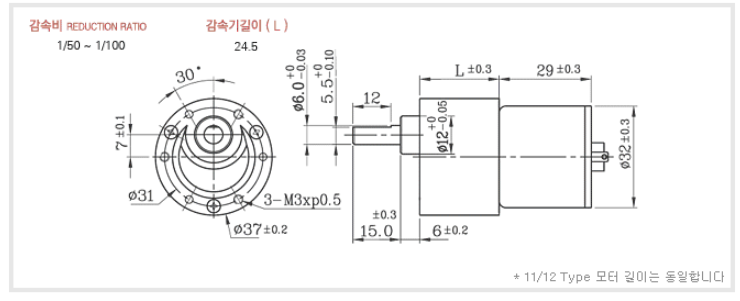

## 3.

## 4.

## 5.

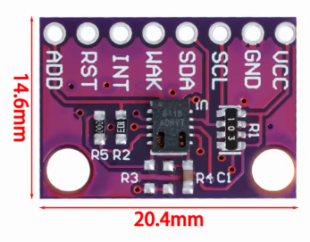

## 6.

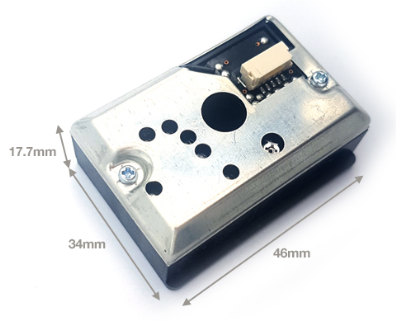

## 7.

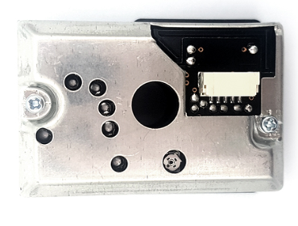

## 8.

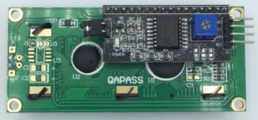

## 9.

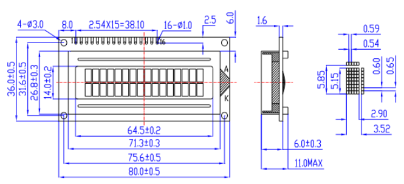

## 10.

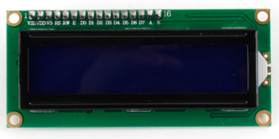

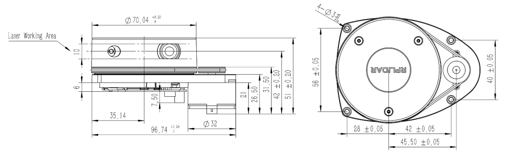

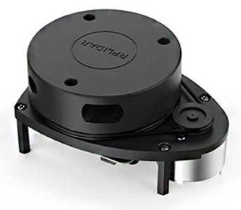

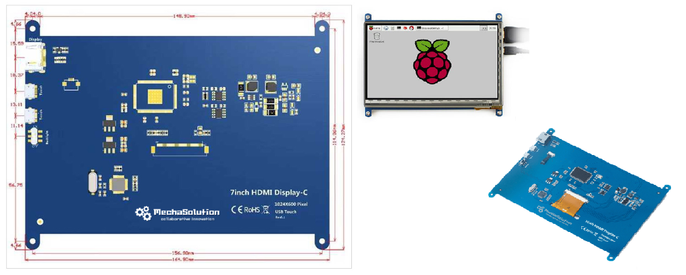

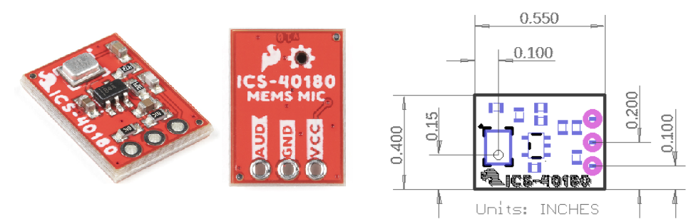

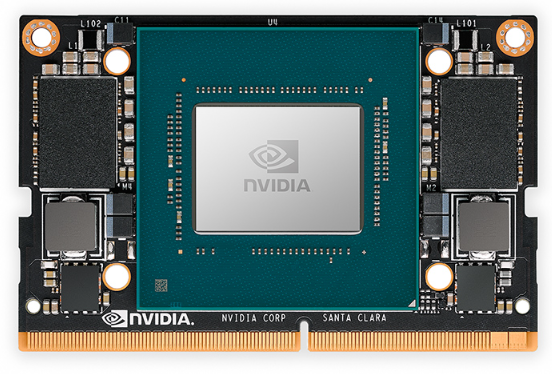

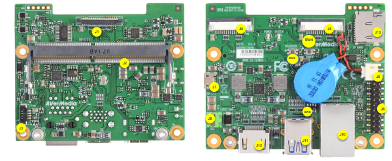

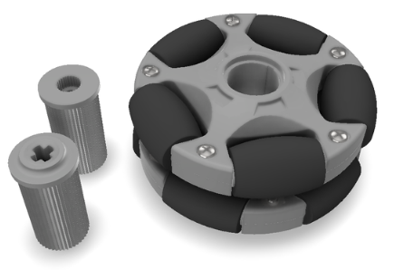

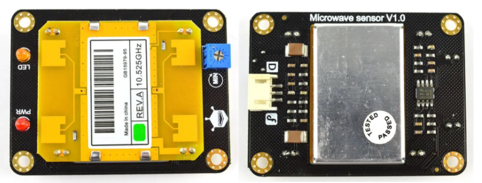

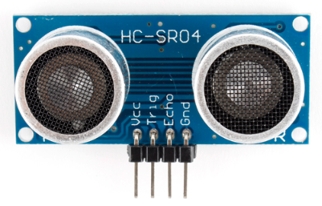

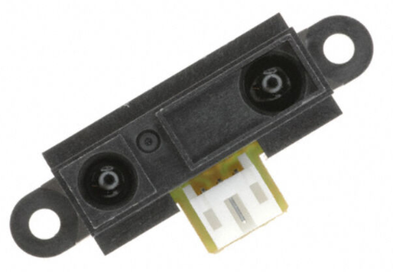

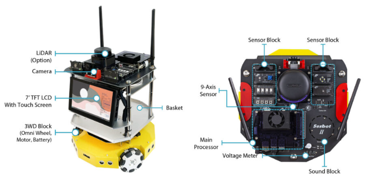

## 참고 링크

- FreeCAD 공식 문서: https://wiki.freecad.org/
- TurtleBot3 Burger 치수: https://www.robotis.com/sub_product/Turtlebot3_Burger
- A2plus 워크벤치: https://github.com/kbwbe/A2plus
