# NVIDIA Jetson Xavier NX 실습 과정

본 과정은 **NVIDIA Jetson Xavier NX** 보드를 활용하여 임베디드 Linux 환경,
센서/카메라 인터페이스, **GPU 기반 AI 추론(TensorRT)**, 그리고 **ROS 2 기반
로봇 통합**까지 실습하는 교육 커리큘럼입니다.

- 대상 보드: NVIDIA Jetson Xavier NX (Developer Kit)
- 호스트 PC: Windows + VirtualBox(Ubuntu) 연동
- 소프트웨어: JetPack SDK, TensorRT, ROS 2 (Humble)
- 참고: 기존 옴니휠 로봇 프로젝트(`Jetson_Xavier_NX_Modul.FCStd`)와 연계


---

## 초기 설정

### NVIDIA Jetson Xavier NX 의 상태를 확인하기

#### 시리얼 접속

  * 상태를 확인하기 위해서 제공되는 USB 케이블을 Omni Wheel 로봇의 오른쪽 측면의 Micro USB 커넥터에 연결하고
  * 한쪽은 PC와 연결합니다.
  * 시리얼 프트 번호를 확인하고 속도는 115200, 8, 1 Stop, No Parity 로 설정하면 아래와 같이 부팅 과정보이고
  * 로그인 대기 화면이 나옵니다.
  * ID 는 bready 이며, PW 는 00000000(0 8개 입니다.)

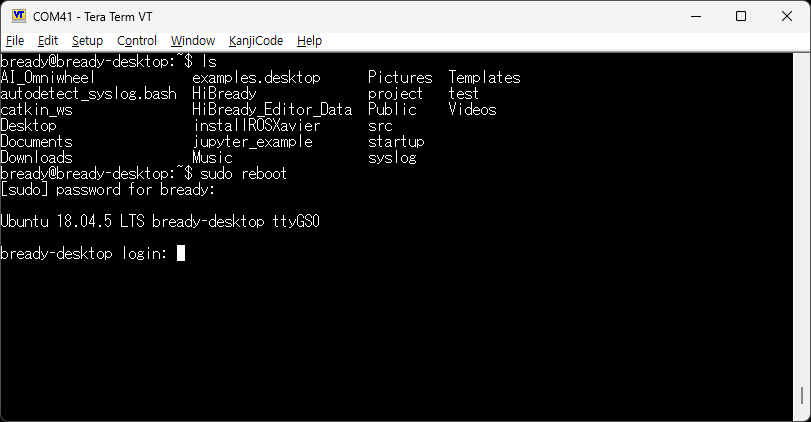

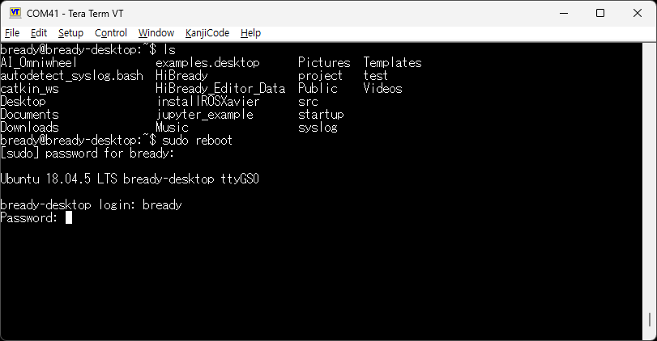

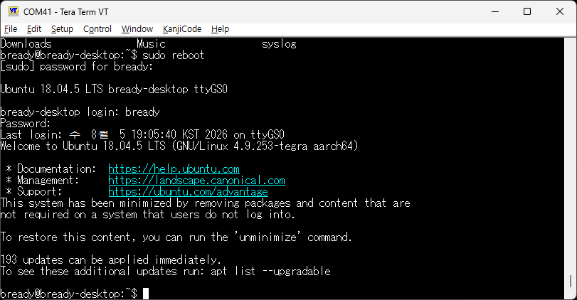

#### 네트워크 접속
   * 시리엏 접속이 와료되면 ifconfig 명령을 통하며 네트워크 IP 를 확인 합니다.
```
bready@bready-desktop:~$ ifconfig
docker0: flags=4099<UP,BROADCAST,MULTICAST>  mtu 1500
        inet 172.17.0.1  netmask 255.255.0.0  broadcast 172.17.255.255
        ether 02:42:2a:38:b7:6d  txqueuelen 0  (Ethernet)
        RX packets 0  bytes 0 (0.0 B)
        RX errors 0  dropped 0  overruns 0  frame 0
        TX packets 0  bytes 0 (0.0 B)
        TX errors 0  dropped 0 overruns 0  carrier 0  collisions 0

eth0: flags=4099<UP,BROADCAST,MULTICAST>  mtu 1500
        ether 48:b0:2d:67:6e:bc  txqueuelen 1000  (Ethernet)
        RX packets 0  bytes 0 (0.0 B)
        RX errors 0  dropped 0  overruns 0  frame 0
        TX packets 0  bytes 0 (0.0 B)
        TX errors 0  dropped 0 overruns 0  carrier 0  collisions 0
        device interrupt 37

l4tbr0: flags=4163<UP,BROADCAST,RUNNING,MULTICAST>  mtu 1500
        inet 192.168.55.1  netmask 255.255.255.0  broadcast 192.168.55.255
        inet6 fe80::1  prefixlen 128  scopeid 0x20<link>
        inet6 fe80::74c8:a7ff:fe67:2a15  prefixlen 64  scopeid 0x20<link>
        ether 76:c8:a7:67:2a:15  txqueuelen 1000  (Ethernet)
        RX packets 2591  bytes 241022 (241.0 KB)
        RX errors 0  dropped 0  overruns 0  frame 0
        TX packets 161  bytes 24152 (24.1 KB)
        TX errors 0  dropped 0 overruns 0  carrier 0  collisions 0

lo: flags=73<UP,LOOPBACK,RUNNING>  mtu 65536
        inet 127.0.0.1  netmask 255.0.0.0
        inet6 ::1  prefixlen 128  scopeid 0x10<host>
        loop  txqueuelen 1  (Local Loopback)
        RX packets 658  bytes 51378 (51.3 KB)
        RX errors 0  dropped 0  overruns 0  frame 0
        TX packets 658  bytes 51378 (51.3 KB)
        TX errors 0  dropped 0 overruns 0  carrier 0  collisions 0

rndis0: flags=4163<UP,BROADCAST,RUNNING,MULTICAST>  mtu 1500
        inet6 fe80::74c8:a7ff:fe67:2a15  prefixlen 64  scopeid 0x20<link>
        ether 76:c8:a7:67:2a:15  txqueuelen 1000  (Ethernet)
        RX packets 2621  bytes 243987 (243.9 KB)
        RX errors 0  dropped 4  overruns 0  frame 0
        TX packets 200  bytes 40796 (40.7 KB)
        TX errors 0  dropped 0 overruns 0  carrier 0  collisions 0

usb0: flags=4163<UP,BROADCAST,RUNNING,MULTICAST>  mtu 1500
        inet6 fe80::74c8:a7ff:fe67:2a17  prefixlen 64  scopeid 0x20<link>
        ether 76:c8:a7:67:2a:17  txqueuelen 1000  (Ethernet)
        RX packets 0  bytes 0 (0.0 B)
        RX errors 0  dropped 0  overruns 0  frame 0
        TX packets 1248  bytes 216060 (216.0 KB)
        TX errors 0  dropped 0 overruns 0  carrier 0  collisions 0

wlan0: flags=4163<UP,BROADCAST,RUNNING,MULTICAST>  mtu 1500
        inet 192.168.0.55  netmask 255.255.255.0  broadcast 192.168.0.255
        inet6 fe80::2635:71c0:1120:d4c5  prefixlen 64  scopeid 0x20<link>
        ether 00:e0:2d:0c:03:e6  txqueuelen 1000  (Ethernet)
        RX packets 2557  bytes 371457 (371.4 KB)
        RX errors 0  dropped 44  overruns 0  frame 0
        TX packets 318  bytes 31482 (31.4 KB)
        TX errors 0  dropped 0 overruns 0  carrier 0  collisions 0

bready@bready-desktop:~$
```
* Mobaxterm을 이용해서 네트워크 터미널로 OmniWheel Robot에 접속 합니다.
* https://mobaxterm.mobatek.net/download.html

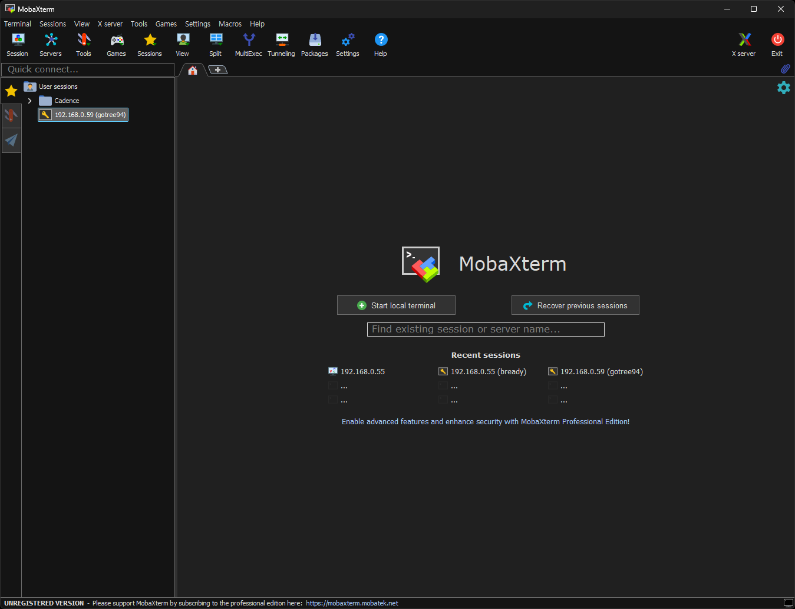

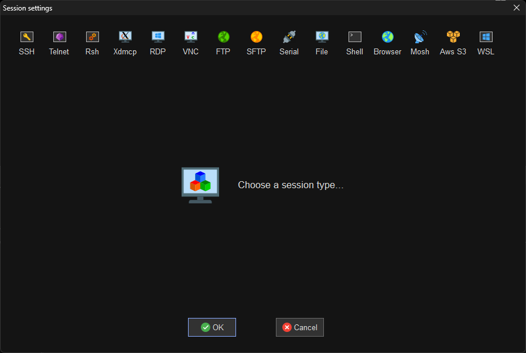

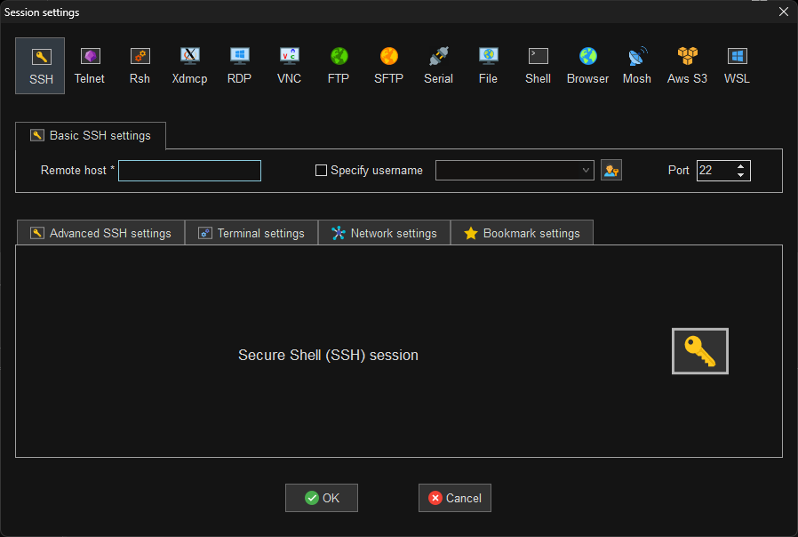

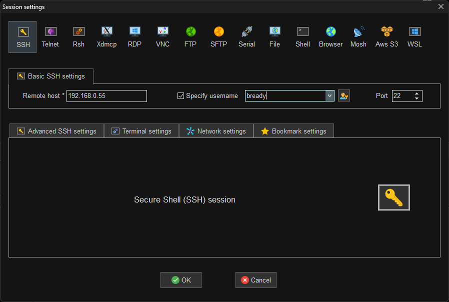

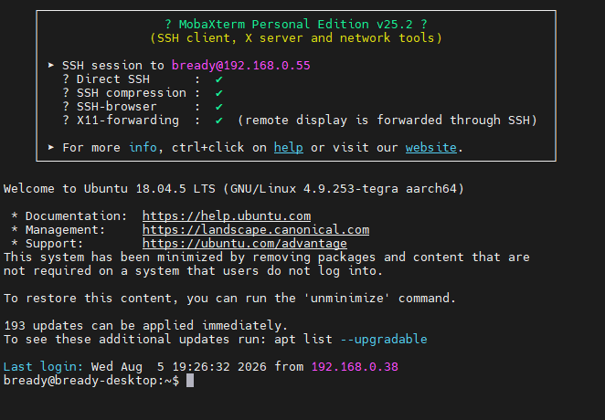

* VNC로 화면으로 원격에서 UI 화면을 보여면 Mobaxterm에서 VNC로 연결해도 됨. (생각보다 속다가 많이 느림)

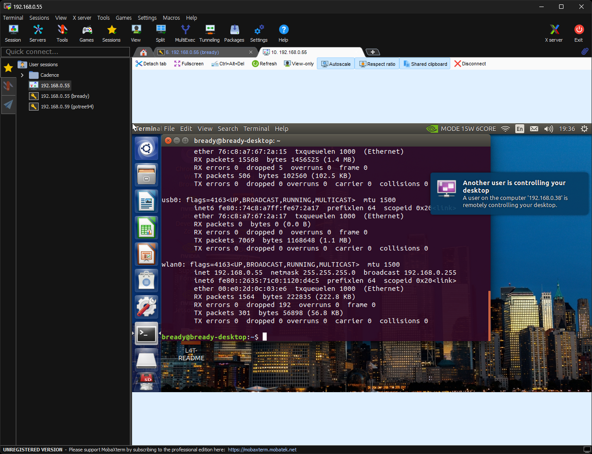

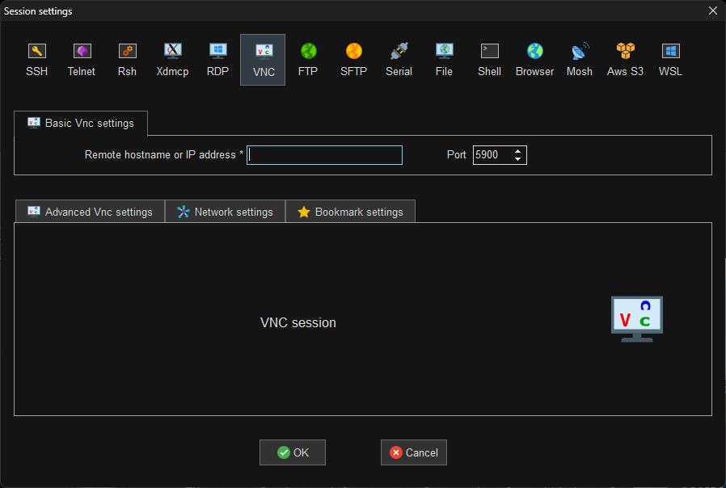

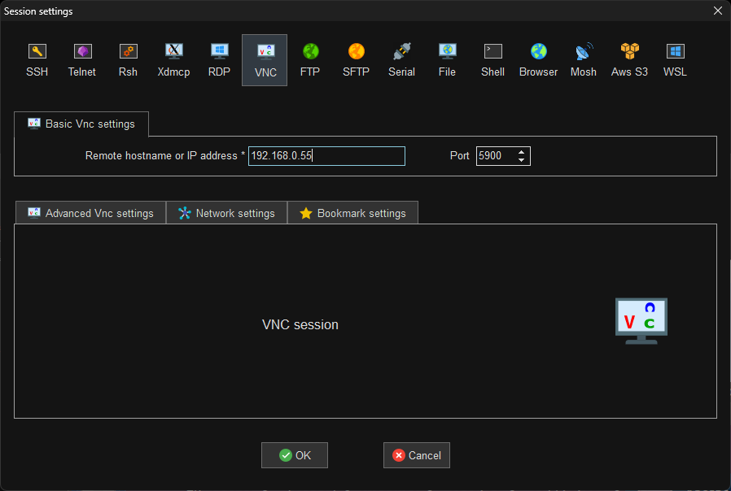


---

## 📝 참고 자료

- NVIDIA Jetson 공식 문서: https://docs.nvidia.com/jetson/
- JetPack SDK: https://developer.nvidia.com/embedded/jetpack
- ROS 2 Humble 문서: https://docs.ros.org/en/humble/
