# FreeCAD 포터블 3D CAD — Omni Wheel Robot

| [한백 SerBot II](https://hanback.com/ko/archives/13575) |  하이브레디 AI Based Omni Wheel Robot | 
|:------------------:|:------------------:|
| 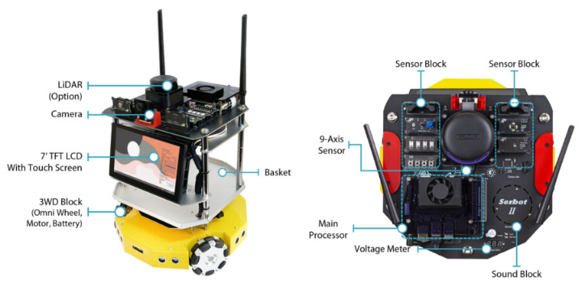 | |
| | (https://www.youtube.com/@hibready/videos) |


[Kinematic Model for 3 Wheel Omni Drive Robot](https://ahnbk.com/?p=852)


## Sensor Module
1. [가스 센서 이산화탄소 감지 센서 모듈](https://ko.aliexpress.com/item/1005006201398375.html)
   * CCS811 CO2 eCO2 TVOC 공기 품질 감지 I2C 출력 CJMCU-811 EGBO

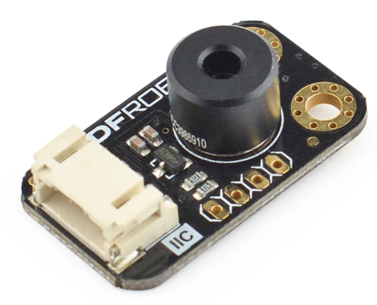 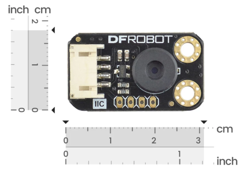

2. [Non-contact IR Temperature Sensor (MLX90614-DCC)](https://www.dfrobot.com/product-1495.html?srsltid=AfmBOorYF6ygLbW_VBrwNELkTxFX2BNwYfql914jLPjDJcdrZ_8oJ0oV)
   * Gravity: I2C Non-contact IR Temperature Sensor For Arduino (MLX90614-DCC)

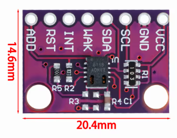

3. [[SHARP] 아두이노 PM2.5 GP2Y1023AU0F 먼지센서, 먼지측정센서, 먼지감지센서](https://www.devicemart.co.kr/goods/view?no=1330859)

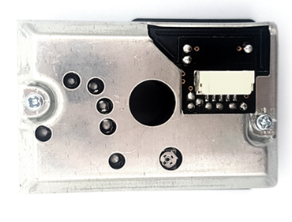  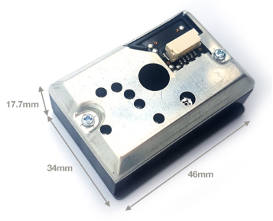

4. [[SLAMTEC] 슬램텍 RPLIDAR A1M8-R6 360도 거리측정 라이다 센서 - 12m](https://www.devicemart.co.kr/goods/view?no=1149202)

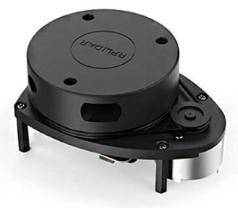  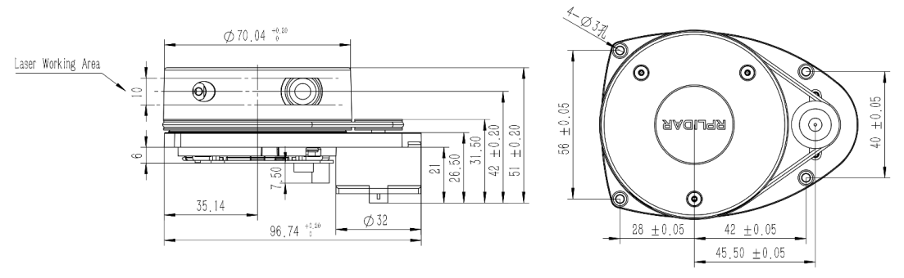


5. [아날로그 MEMS 마이크로폰 ICS-40180 모듈 (SparkFun Analog MEMS Microphone Breakout - ICS-40180)](https://vctec.co.kr/product/%EC%95%84%EB%82%A0%EB%A1%9C%EA%B7%B8-mems-%EB%A7%88%EC%9D%B4%ED%81%AC%EB%A1%9C%ED%8F%B0-ics-40180-%EB%AA%A8%EB%93%88-sparkfun-analog-mems-microphone-breakout-/18869/)

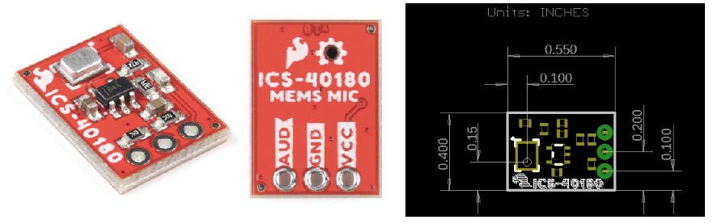 


## Display

1. [[SMG] 아두이노 I2C 1602 LCD 모듈 [SZH-EK101]](https://www.devicemart.co.kr/goods/view?no=1327456)

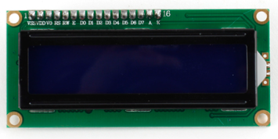  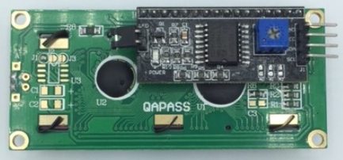 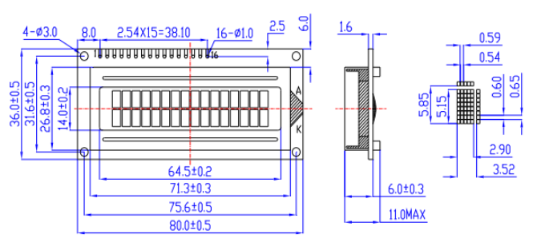

2. [[PRC] 7인치 라즈베리파이 1024x600 HDMI 터치스크린 LCD / Raspberry Pi 7inch HDMI LCD (C)](https://www.devicemart.co.kr/goods/view?no=12230962)

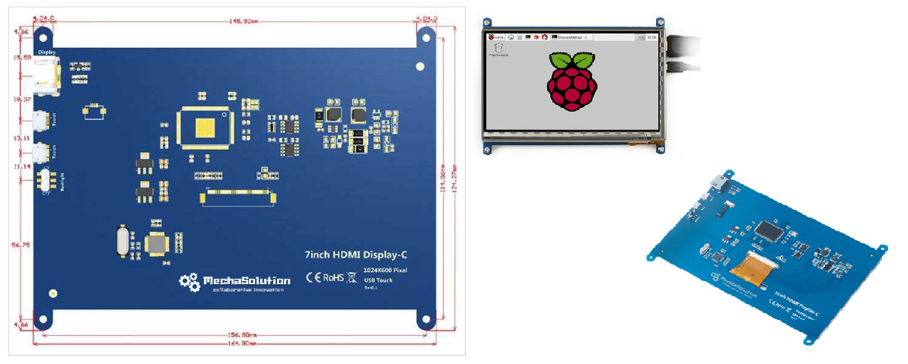

## Motor

1. [[㈜디엔지위드] 감속기어모터 RB-35GM 11TYPE (12V)](https://www.devicemart.co.kr/goods/view?no=1326498&srsltid=AfmBOoo1Or-5vLKh5g1OgqoyQw9leiDbCRuTJaa8bsq4JtpsVzvChmy5)

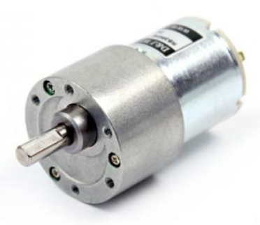  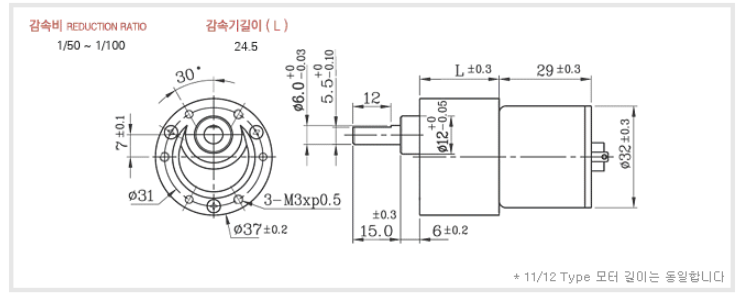

## Wheel

1. [58mm Plastic Omni Wheel with Lego motor, BO(TT) motor & Servo Couplings](https://grabcad.com/library/58mm-plastic-omni-wheel-with-lego-motor-bo-tt-motor-servo-couplings-1)


---

### 로봇 BOM에서는 보통 기능(Function) 또는 부품 특성(Component Type) 기준으로 분류

* 센서류	(Sensors)	LiDAR, Camera, IMU, Encoder, Limit Switch, ToF, Ultrasonic
* 디스플레이류	(Displays / Display Modules)	LCD, OLED, Touch Panel, HMI
* 모터류	(Motors)	BLDC, DC Motor, Servo Motor, Stepper Motor
* 감속기류	(Gearboxes / Reducers)	Planetary Gear, Harmonic Drive, Cycloidal Reducer
* 구동부	(Actuators)	Linear Actuator, Rotary Actuator, Electric Cylinder
* 엔코더류	(Encoders)	Absolute Encoder, Incremental Encoder
* 브레이크류	(Brakes)	Electromagnetic Brake
* 전원부	(Power Supply	SMPS, DC-DC Converter, AC Adapter
* 배터리류	(Batteries)	Li-ion Battery, BMS, Battery Pack
* 제어기류	(Controllers)	Motion Controller, Robot Controller
* 컴퓨팅 모듈	(Computing Modules)	IPC, SBC, CPU Board, GPU Module
* 통신장치	(Communication Devices)	Ethernet Switch, Wi-Fi Module, LTE Module, CAN Device
* PCB류	(PCBs / Printed Circuit Boards)	Main PCB, Interface PCB
* 전자부품	(Electronic Components)	IC, MCU, FPGA, Relay
* 케이블류	(Cables)	Power Cable, Signal Cable, Ethernet Cable
* 커넥터류	(Connectors)	JST, Molex, Circular Connector
* 스위치류	(Switches)	Toggle Switch, Emergency Stop, Push Button
* 릴레이류	(Relays)	Relay, SSR
* 퓨즈류	(Fuses)	Fuse, Circuit Breaker
* 냉각부품	(Cooling Components)	Fan, Heat Sink
* 프레임류	(Frames / Structural Parts)	Base Frame, Aluminum Profile
* 외장부품	(Covers / Enclosures)	Cover, Housing, Panel
* 브라켓류	(Brackets)	Mounting Bracket, Sensor Bracket
* 샤프트류	(Shafts)	Motor Shaft, Drive Shaft
* 베어링류	(Bearings)	Ball Bearing, Linear Bearing
* 풀리류	(Pulleys)	Timing Pulley
* 벨트류	(Belts)	Timing Belt
* 체인류	(Chains)	Roller Chain
* 기어류	(Gears)	Spur Gear, Bevel Gear
* 바퀴류	(Wheels)	Drive Wheel, Caster
* 캐스터류	(Casters)	Swivel Caster, Fixed Caster
* 체결부품	(Fasteners)	Bolt, Nut, Screw, Washer
* 스페이서류	(Spacers / Standoffs)	Spacer, Standoff
* 씰류	(Seals)	O-ring, Oil Seal, Gasket
* 공압부품	(Pneumatic) Components	Cylinder, Solenoid Valve
* 유압부품	(Hydraulic) Components	Hydraulic Cylinder, Valve
* 조명류	(Lighting)	LED Module, Beacon
* 음향장치	(Audio Devices)	Speaker, Buzzer, Microphone
* 안전장치	(Safety Devices)	Safety Relay, Safety Scanner, Light Curtain
* 비전장치	(Vision Systems)	Industrial Camera, Depth Camera
* 안테나류	(Antennas)	Wi-Fi Antenna, GPS Antenna
* 소모품	(Consumables)	Grease, Tape, Cable Tie


---

### 로봇 회사에서 많이 사용하는 상위 분류 예시

```
01. Structural Parts      (구조물)
02. Mechanical Parts      (기계부품)
03. Actuators             (구동부)
04. Motors                (모터류)
05. Reducers              (감속기류)
06. Sensors               (센서류)
07. Electronics           (전자부품)
08. Control Systems       (제어기)
09. Computing             (컴퓨팅)
10. Power Systems         (전원)
11. Batteries             (배터리)
12. Communication         (통신)
13. Displays              (디스플레이)
14. Cables & Connectors   (케이블 및 커넥터)
15. Safety Components     (안전부품)
16. Pneumatics            (공압)
17. Hydraulics            (유압)
18. Fasteners             (체결부품)
19. Consumables           (소모품)
20. Accessories           (기타 액세서리)
```


---


### 추천 (관리하기 좋은 BOM 구조)

* 상위 분류는 너무 많지 않게 15~20개 정도로 유지하고, 하위 분류를 두는 것이 가장 관리하기 편합니다.


```
Motors
 ├─ BLDC Motor
 ├─ Servo Motor
 ├─ Stepper Motor

Sensors
 ├─ Camera
 ├─ LiDAR
 ├─ IMU
 ├─ Encoder
 ├─ Ultrasonic
 ├─ ToF

Power
 ├─ Battery
 ├─ BMS
 ├─ SMPS
 ├─ DC/DC Converter

Mechanical
 ├─ Bearings
 ├─ Gears
 ├─ Shafts
 ├─ Wheels
 ├─ Brackets

Electrical
 ├─ PCB
 ├─ Cable
 ├─ Connector
 ├─ Relay
 ├─ Fuse
```


