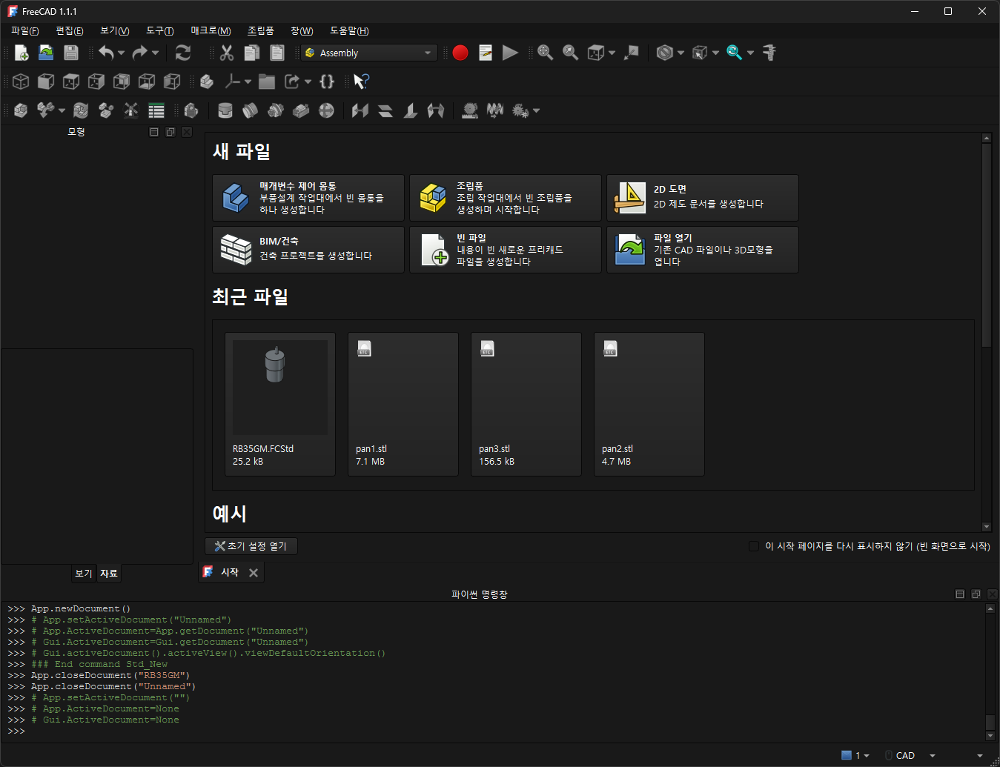

# Day 1 · Step 1 — FreeCAD 포터블 설치 및 인터페이스 둘러보기

**소요시간**: 40min  
**목표**: FreeCAD 포터블 버전을 설치하고, 기본 인터페이스와 주요 작업대(Workbench)를 익힌다.

---

## 1. FreeCAD 포터블 다운로드

### 1.1 다운로드 링크

```
https://github.com/FreeCAD/FreeCAD/releases/download/1.1.1/FreeCAD_1.1.1-Windows-x86_64-py311.7z
```

파일 크기: 약 460MB (압축), 약 1.5GB (압축 해제 후)

### 1.2 압축 해제

1. `FreeCAD_1.1.1-Windows-x86_64-py311.7z` 파일을 다운로드한다.
2. 마우스 우클릭 → **7-Zip → Extract Here** 또는 **Extract to "FreeCAD_1.1.1-Windows-x86_64-py311"**
3. 폴더 안에 있는 `bin/FreeCAD.exe`가 실행 파일이다.

> **포터블이란?**
> 설치 필요 없이 USB 메모리에 넣어서 아무 PC에서 바로 실행할 수 있다.
> 이 과정에서는 PC 바탕화면 또는 `C:\FreeCAD` 폴더에 압축을 풀어 사용한다.

### 1.3 실행 확인

```
C:\FreeCAD\bin\FreeCAD.exe
```

또는 탐색기에서 `FreeCAD.exe` 더블클릭

---

## 2. FreeCAD 인터페이스 둘러보기

FreeCAD를 실행하면 다음과 같은 화면이 나타난다:

```
┌──────────────────────────────────────────────────────────┐
│  [메뉴바] File · Edit · View · Tools · Windows · Help   │
├──────────────────────────────────────────────────────────┤
│  [도구모음]  작업대 콤보박스 │ 표준 도구 │ 스케치 도구  │
├──────────┬───────────────────────────────┬───────────────┤
│  [조합보기]│     [3D 뷰]                 │ [속성창]      │
│  · 모델 트리 │                           │ · 탭/뷰       │
│  · 태스크   │     (메인 작업 영역)       │ · 데이터      │
│  · 종속성   │                           │ · 베이스       │
├──────────┴───────────────────────────────┴───────────────┤
│  [상태 표시줄]  좌표 · 명령 안내 · 선택 정보              │
└──────────────────────────────────────────────────────────┘
```



### 2.1 주요 영역

| 영역 | 설명 |
|------|------|
| **3D 뷰 (3D View)** | 모델을 보고 회전/이동/확대하는 메인 작업 공간 |
| **조합보기 (Combo View)** | 왼쪽 패널 — 모델 트리(Model Tree)와 태스크(Task) 탭 전환 |
| **속성창 (Property View)** | 선택한 객체의 속성(치수, 위치, 각도 등) 표시 및 수정 |
| **도구모음 (Toolbar)** | 자주 사용하는 명령 버튼 모음 |
| **작업대 콤보박스 (Workbench)** | 현재 작업대를 표시하고 변경하는 드롭다운 |

### 2.2 마우스 조작 (필수)

| 동작 | 명령 | 설명 |
|------|------|------|
| 화면 회전 | 마우스 가운데 버튼 누른 채 드래그 | 모델을 돌려본다 |
| 화면 이동 | `Ctrl` + 마우스 가운데 드래그 | 뷰를 상하좌우로 이동 |
| 확대/축소 | 마우스 휠 돌리기 | 더 가까이/멀리 보기 |
| 객체 선택 | 마우스 왼쪽 버튼 클릭 | 모델 트리 또는 3D 뷰에서 선택 |
| 상자 선택 | 마우스 왼쪽 드래그 (사각형 영역) | 여러 객체 동시 선택 |

> **팁**: 숫자 키패드 `0`을 누르면 등각(isometric) 뷰, `1`은 정면, `2`는 위쪽 등 빠른 뷰 전환이 가능하다.

---

## 3. 주요 작업대(Workbench) 소개

FreeCAD는 작업 목적에 따라 작업대를 변경하며 사용한다.

| 작업대 | 용도 | 이 과정에서 사용 |
|--------|------|:---:|
| **Part Design** | 솔리드 부품 모델링 (스케치 → Pad/Pocket) | ✅ 핵심 |
| **Sketcher** | 2D 스케치 작성 (구속 조건 포함) | ✅ 핵심 |
| **A2plus** | 여러 부품을 조립 (Assembly) | ✅ Day 2 |
| **FEM** | 유한요소해석 (구조 강도 해석) | ✅ Day 2 |
| **Part** | 기본 형상(박스/원통/구) 생성 + 불리언 연산 | 보조 |
| **Draft** | 2D 평면 도면 작성 | 보조 |
| **TechDraw** | 기술 도면(2D orthographic) 출력 | 생략 |

### 작업대 변경 방법

```
작업대 콤보박스 (도구모음 왼쪽 끝) → "Part Design" 선택
```

또는 메뉴: `View → Workbench → Part Design`

---

## 4. 기본 환경 설정 (선택)

### 4.1 언어 설정

`Edit → Preferences → General → Language → 한국어` → Apply

### 4.2 내보내기 설정

`Edit → Preferences → Import-Export → STEP → Automatically run` 체크

---

## 5. 확인 문제

1. FreeCAD 포터블을 실행하려면 어떤 파일을 더블클릭해야 하는가?
2. 3D 뷰에서 화면을 회전하려면 마우스 어떤 버튼을 사용해야 하는가?
3. 솔리드 부품을 모델링할 때 가장 많이 사용하는 작업대는 무엇인가?

> **정답**: ① `FreeCAD.exe`, ② 마우스 가운데 버튼, ③ Part Design

---

## ✅ Step 1 완료 체크리스트

- [ ] FreeCAD 포터블이 정상 실행되었다
- [ ] 3D 뷰를 마우스로 자유롭게 회전/이동/확대할 수 있다
- [ ] 작업대를 Part Design으로 변경할 수 있다
- [ ] 조합보기(Combo View)의 모델 트리와 태스크 패널을 구분할 수 있다
