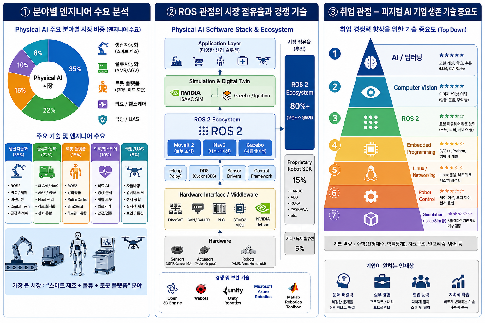
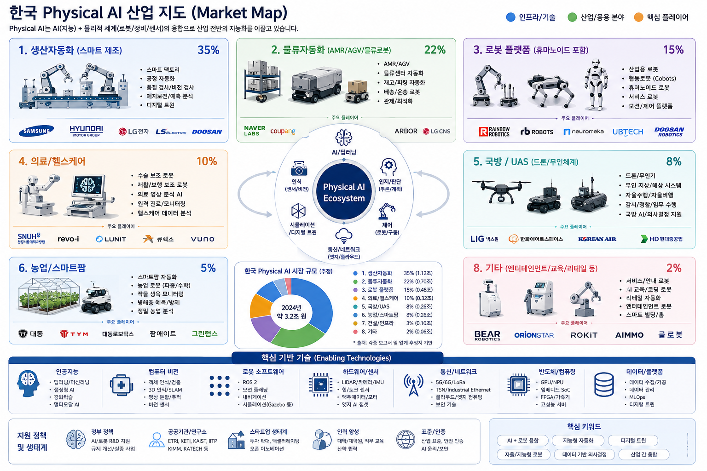
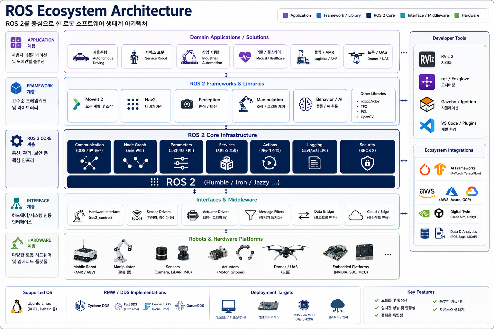
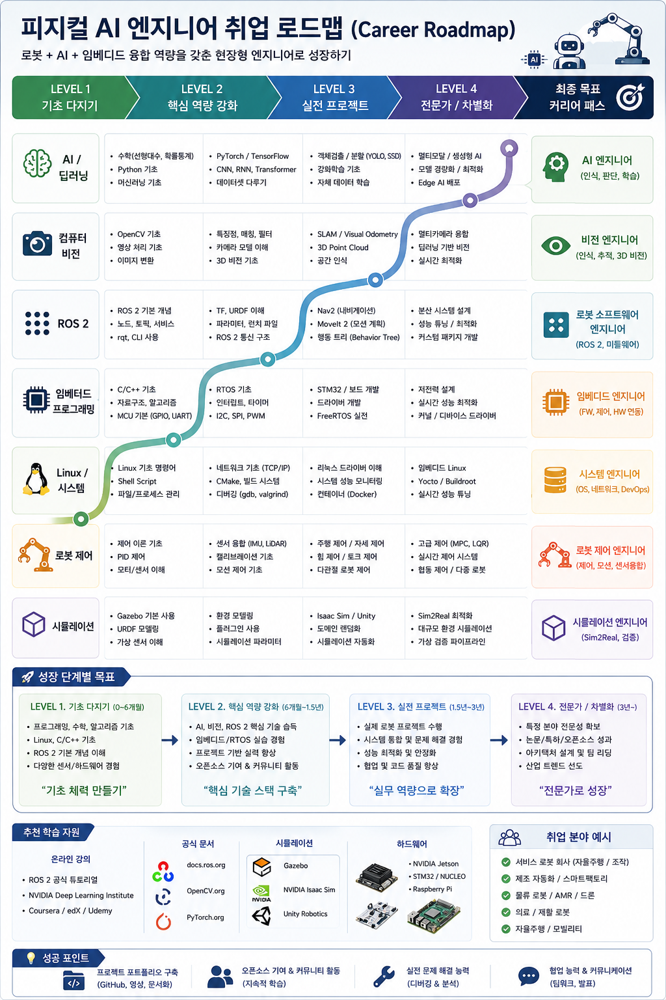

# 전체 문서 개요

> 직업계고 채용연계형 직무교육과정「자율주행하드웨어개발」(70h) 교육 자료
> NVIDIA Jetson AGX + 옴니휠 3 + 초음파3 + IR3 + LiDAR + 습도/화재센서 + LCD

---

## 문서 목록

| 번호 | 파일명 | 내용 |
|------|--------|------|
| 01 | `01_커리큘럼_개요.md` | 과정 개요, 교육 철학, 학습 로드맵, 평가 방식 |
| 02 | `02_일차별_교육계획서.md` | 12일(70h) 시간표, 일차별 체크 포인트 |
| 03 | `03_하드웨어_개발환경_가이드.md` | GPIO 핀맵, 센서/모터/LiDAR/LCD 연결 코드, ROS2 기초, 문제해결 |
| 04 | `04_실습_워크북.md` | 난이도별 실습 10개 (초음파 → 옴니휠 → ROS2 → 벽따라가기 → 화재감지) |
| 05 | `05_미니프로젝트_가이드.md` | 콘테스트 규칙, 팀 역할, 개발 일정, 코드 구조, 발표 가이드 |

---

## 문서 간 관계

```
00_전체_문서_개요.md
│
├─ 01_커리큘럼_개요.md        ← 과정 전체 방향과 평가 계획
│     │
│     └─ 02_일차별_교육계획서.md  ← 12일차 상세 일정
│           │
│           ├─ 03_하드웨어_개발환경_가이드.md  ← 하드웨어 연결법 (실습의 재료)
│           │
│           ├─ 04_실습_워크북.md              ← 단계별 실습 (일정 속 각 실습의 상세)
│           │
│           └─ 05_미니프로젝트_가이드.md      ← 통합 프로젝트 (6~10일차)
```

---

## 활용 순서 (강사용)

1. **01 → 02 순서로 과정 전체 개요 파악**
   - 교육 철학 이해 (실습 70%, 탐색 중심)
   - 12일 전체 일정 확인
2. **02 파일의 각 일차별 계획 확인**
   - 해당일 실습 주제를 03(하드웨어 가이드)에서 하드웨어 연결법 확인
   - 해당일 실습 내용을 04(실습 워크북)에서 상세 코드 및 절차 확인
3. **6일차부터 05(미니프로젝트 가이드) 참고**
   - 팀 구성, 콘테스트 규칙, 발표 가이드 활용

---

## 교육 철학 요약

| 원칙 | 설명 |
|------|------|
| **실습 우선** | 이론 30% / 실습 70%, 일단 해보고 부딪히며 배움 |
| **진로 탐색** | 전문가 양성이 아닌 관련 분야 적합성 판단이 목적 |
| **실패 허용** | 트러블슈팅 과정 자체를 학습으로 인정 |
| **팀 협업** | 전 실습을 팀 단위로 수행, 역할 분담 경험 |
| **통합 경험** | 개별 센서 → 통합 시스템 → 콘테스트로 이어지는 전체 흐름 체험 |

---

## 주요 변경사항 (원계획 대비)

| 구분 | 원계획 (TurtleBot3) | 변경 (NVIDIA AGX 플랫폼) | 교육적 효과 |
|------|---------------------|------------------------|------------|
| 메인보드 | Raspberry Pi | NVIDIA Jetson AGX | GPIO 직접 제어 경험 |
| 구동계 | DC 모터 x 2 | 옴니휠 x 3 (BLDC/DC) | 운동학 벡터 분해 학습 |
| 센서 | 제한적 | 초음파3+IR3+LiDAR+습도+화재 | 다양한 센서 융합 경험 |
| 개발 방식 | SDK 활용 | 직접 GPIO + ROS2 | 하드웨어-소프트웨어 경계 이해 |











